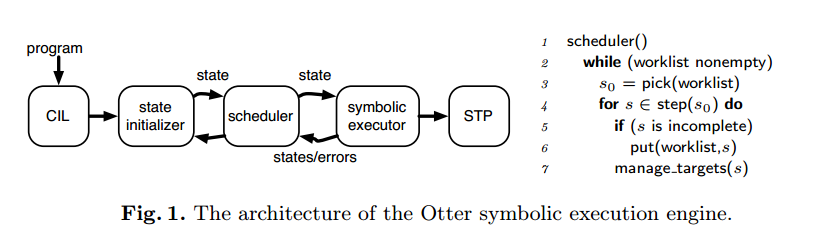

导向式符号执行
==============

摘要
====

研究“自动查找程序执行，到达特定目标行”问题。该问题出现在很多调试工作中，例如，开发者希望确认静态分析报告中特定行上的bug是否正确。本文提出两个导向式符号执行策略来解决该问题。

1 最短距离符号执行(SDSE)使用距离度量，在过程间的控制流图中引导符号执行到指定目标；

2 后向调用链符号执行(CCBSE)迭代进行前向符号执行，从包含目标行的函数开始，然后向后跳转到调用链，直到发现从程序入口的一条可用路径。

3 还提出了一个混合策略，Mix-CCBSE：CCBSE和另一个前向搜索策略交替。

将这三个方法和一些现有文献中的策略在六个GNU
coreutils程序进行比较实验，发现SDSE在很多情况下表现非常好，但是可能严重失败。CCBSE也表现良好，但可能增加了开销，导致有时比SDSE慢。综合考虑，Mix-CCBSE结合了组成部分的优点，平均表现最好。

1 简介
======

本文研究“行可达问题”：给定程序中的一个目标代码行，是否能找到一条到达改行的实际路径。

提出了两个导向式符号执行搜索策略：

1. 最短距离符号执行。

2. 后向调用链符号执行。

3. 混合策略。

2 导向式符号执行
================

本文基于Otter(作者之前实现的符号执行工具)，说明并实现了SDSE，CCBSE和Mix-CCBSE策略，但这些策略适用于各种符号执行工具，如KLEE，SAGE等。

Otter符号执行引擎架构：使用CIL产生CFG，然后调用状态初始化器创建初始化符号执行状态，并存储在worklist中。状态包括了栈、堆、寄存器和到达当前点的路径。传统符号执行，调用前向符号执行，从程序入口main函数状态开始。调度引擎使用pick从worklist中选择一个状态并调度step执行下一条指令。当遇到符号条件时，调用STP进行求解满足性。符号执行将求解状态返回到调度程序，incomplete状态添加到worklist中。Manage\_targets是用来引导CCBSE后向搜索的。

2.1 前向符号执行
----------------

不同的前向符号执行策略区别于不同的pick函数。本文实现了三个搜索策略：

1. 随机路径(RP)宽度优先搜索的概率版本。随机从worklist选取状态，相当于给不同长度的路径赋予不同权值2\^-n。

2. KLEE使用a round-robin of RP
和我们使用的closest-to-uncovered最近没有覆盖，计算每个状态路径末端和最近没有覆盖节点在过程间控制流图上的距离，并赋予每个状态与距离大小相反的权值。

3. SAGE使用覆盖率引导“世代”搜索发现执行树中的状态。首先，SAGE从初始状态开始，通过随机选择状态直到程序结束。存储剩余状态到worklist作为第一代孩子。然后，SAGE运行每个一代孩子到完成，孙子被它们的第一代父母分别分组。搜索完一代之后，SAGE以更混合的方法搜索下一代，使用块覆盖率启发式来确定哪些世代探索首先。

2.2 最短距离符号执行SDSE
------------------------

**思想：**在ICFG上，距离目标路径最短的程序分支优先。

**实例：**

如上图，当参数中‘b’的数量大于4时，第八行将发生溢出。如果使用随机搜索，只有很小的概率到达assert发现溢出。KLEE和SAGE等符号执行关注于覆盖率，浪费时间在不能触发bug的路径上。

SDSE适用于该问题，以第7行为目标行。首先在循环入口，会执行循环内的第一条指令，而不是跳过循环，因为这样距离目标行比较近。然后在第6行会判断为真，这样可直接执行assert。执行第8行状态，优先于第10、12行，因为第8行距离目标仅三行。然后循环返回入口，重复以上工作。结果路径如图右部分中间路径。

**实现：**

Distance-to-target定义：函数内，在CFG上状态之间边的数量；函数间，在ICFG上，从指令到目标的最短距离长度。

2.3 后向调用链符号执行CCBSE
---------------------------

SDSE不适用与某些情况：到达目标行有多个潜在路径，但是只有少量长路径可达。在这种情况下CCBSE是更有效的。

**思想：**从目标行所在函数开始，先进行符号执行求解到达断言处的输入；再返回调用该函数的函数，进行符号执行，求解到达函数调用点的输入，可以直接穿透复杂函数，迭代该过程直到程序入口点。“函数调用链反向搜索，函数内正向符号执行。”

实例：

如上图，RP，KLEE，SAGE和SDSE都不适用于该情况。CCBSE从函数f开始，符号化m和n，搜索循环中的2\^6条路径，发现到达assert的为p。当p发现后，跳转到main函数执行搜索发现到达f的调用点。在调用点，将根据p直接穿透f，快速到达目标行。

**实现：**CCBSE在pick和manage\_targets中实现。Pick函数包括两步骤：首先，选择源函数f（包含目标行的函数），根据源函数选择一个状态。它选择从main函数最短调用链的函数。然后，pick函数根据前向搜索策略进行f的状态选择。CCBSE(S)表示CCBSE使用前向搜索策略S。

Manage\_targets函数如下图，主要作用是记录到达目标行的路径，使用到达目标的后缀路径连接状态s。首先，从状态s中解析出源函数sf和从函数sf到当前点的路径p。如果p的结尾已经到达目标，则调用update\_paths将p和sf结合在一起，将p添加到从sf到目标的路径列表中。否则，如果一个路径结尾调用了其他函数f，并且该函数有到目标的路径，则使用f的路径扩展p，遍历f的路径p’，检查p+p’是否可用。如果可用则添加到sf路径中。update\_path的作用是添加p到sf的路径中，如果sf没有路径，则为调用sf的函数创建初始状态，并添加到worklist中。

2.4 混合CCBSE和前向搜索
-----------------------

虽然CCBSE可以更快的发现一条路径，但是带来了消耗：它的queries比前向复杂，并且花费了时间尝试从程序中间开始的路径，但是这些路径不可用。

**思想：**从main函数进行前向的符号执行，同时CCBSE也执行。

**实例：**

如图，使用CCBSE当反向搜索到函数g时，不知道m至少为30，则导致对m属于[0,36]进行搜索，造成时间浪费。使用Mix-CCBSE，在执行CCBSE同时从main开始符号执行。当反向搜索到函数g时，知道m\>=30，减少了搜索范围。

**实现：**通过修改pick函数实现mix-CCBSE，每个step的时候，决定使用前向或者CCBSE，通过花费时间五五分，花费时间=50\*调用求解器的次数+执行指令的次数。

3 实验
======

进行了两组实验：类似第二节中的小程序例子和6个GNU Coreutils。

图(a)给出了导向式搜索策略的结果，为了比较，实现了SDSE的过程内版本，忽略了调用链：如果目标行不下当前函数，则距离为∞。IntraSDSE指过程内，InterSDSE指标准SDSE。表列出了分别使用三种前向搜索(RP，InterSDSE，IntraSDSE)的CCBSE，后两种使用最短距离作为CCBSE的后向搜索。图(b)给出了KLEE的运行结果。图(c)给出了使用不同前向搜索策略的Otter和它们与CCBSE的混合。Mix-CCBSE(S)指混合策略使用S作为前向搜索策略，使用CCBSE(RP)作为后向搜索策略。

重复41次试验，表中主要数字表示中位数，小的数字表示四分位数SIQR，括号里表示离群点的数量（大于3\*SIQR或小于SIQR）。每个人工例子限时600秒，Coreutils限时1800秒，有一半超时则中位数为∞。加阴影的表示每行最快的两次。

3.1 构造的程序

前三行表示构造的程序，对于图2的例子，SDSE表现最好；因为main是目标行所在函数，CCBSE(X)和X等价。

对于图4，CCBSE(SDSE)比较快。

对于图6，Mix-CCBSE(RP or KLEE)比较快，其他方法都不适用。

3.2 GNU Coreutils

表中下半部分是6个Coreutils程序。包含了2.4千行代码和一个30千行代码的动态库。每个bug，手工添加了assertion，设置了目标行。

从结果看出，InterSDSE表现很好，除了没有到达mknod。最后一行表示总时间，混合策略表现的比较好。Mix-CCBSE(Otter-KLEE)表现最好。

3.3 威胁正确性

分析了影响结论正确性的威胁因素。

4 其他相关工作
==============

介绍了一些他人工作。

5 结论
======

研究了目标行（静态分析得到）可达问题。提出了两种方法：SDSE和CCBSE。讨论了混了CCBSE和前向搜索策略。在Otter中实现了这些策略，并在6个Coreutils程序中和三个构造程序中进行了实验。结果说了了SDSE和混合CCBSE(KLEE)的性能较好。
