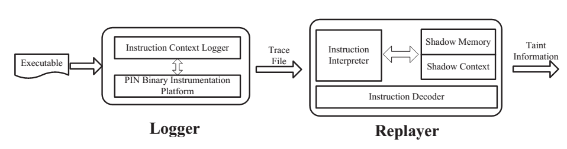
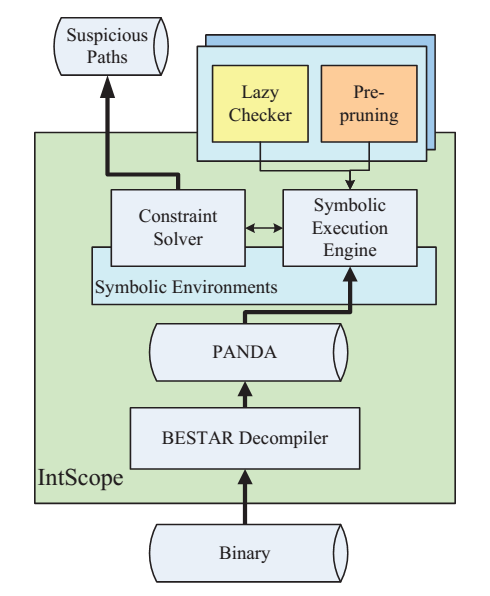

**面向二进制程序的漏洞挖掘关键技术研究**
========================================

主要贡献：

1. 首次提出校验和（checksum）感知的模糊测试方法。（第四章）

2. 提出了一种基于 roBDD的离线细颗粒度污点分析方法。（第二章）

3. 为进一步提高模糊测试的挖掘效率，提出了一种基于细颗粒度污点分析 (Fine-grained
Taint Analysis)的导向性样本生成方法。（第五章）

4. 为进一步加强模糊测试的安全分析能力，提出了一种基于混合符号执行 (Conclic
Execution)的智能样本生成方法。（第五章）

5. 提出了一种面向脆弱性包络 (Vulnerable
Component)的整数溢出漏洞静态挖掘方法。（第六章）

6. 设计实现了软件安全漏洞动态挖掘系统 TaintScope和整数溢出漏洞静态挖掘系统
IntScope。

**第一章 绪论**
===============

二进制程序漏洞挖掘的重要意义。

漏洞挖掘研究现状
----------------

漏洞发现技术概览

被动挖掘：基于攻击分析、基于补丁分析

1. 基于蜜罐、蜜网捕获攻击样本是攻击分析的基础手段。

2.基于补丁分析的漏洞发现技术主要依赖于软件开发方发布的补丁信息，进而定位和恢复被修补的漏洞信息。

主动挖掘：手工漏洞发现、静态漏洞挖掘、动态漏洞挖掘

手工漏洞发现：1973.缺陷假设法

静态漏洞挖掘：简单模式对比阶段、数据流分析阶段、自动机可描述漏洞模式、复杂数据约束关系模式（静态符号执行）

动态漏洞挖掘：事件空间遍历、输入空间遍历（Fuzzing）、程序执行路径遍历

**第二章 基于 roBDD的细颗粒度污点分析技术**
===========================================

针对问题
--------

细粒度污点分析面临内存消耗、性能低的问题。

解决方法
--------

提出一种基于有序二元决策图（roBDD）的细颗粒度污点分析技术，实现了离线污点分析系统TaintReplayer。

TaintReplayer系统架构

实验设计
--------

与基于STL的bitset的污点分析系统进行对比试验，选择两个目标程序：Adobe
Acrobat和Google Picasa分析一副PNG图片。

实验结果
--------

TaintReplayer内存需求少，分析效率高。

**第三章 面向二进制程序的混合符号执行技术**
===========================================

本章无创新点，介绍符号执行技术的原理、发展历史，分析符号执行技术的不足。结合二进制程序分析的需求，介绍一种面向二进制程序的混合符号执行技术的设计与实现。

符号执行面临难题：

1.对硬件性能要求高

2.处理递归调用、循环很难确定其执行次数

3.调用第三方库无法模拟执行

4.处理矢量数据（数组、字符串）存在困难

面向源码的符号执行

面向二进制的符号执行困难：缺乏大量信息；低级指令语义复杂；程序执行轨迹包含指令数目庞大。

两个重要技术选择：在线vs离线；底层指令系统vs中间代码

在线符号执行问题：导致目标程序性能严重下降；基于二进制代码植入技术，复杂；分析并行程序困难。

设计实现了面向二进制的离线混合符号执行系统SymReplayer

SymReplayer设计架构：轨迹执行模块、指令翻译模块、混合符号执行模块

**第四章 校验和感知的模糊测试技术**
===================================

针对问题
--------

基于校验和机制的数据完整性检查成为传统模糊测试系统的重要障碍

传统的畸形数据（测试用例）的生成方法可以分为两类：基于变异和基于规范

解决方法
--------

提出了一种校验和感知的模糊测试方法。解决办法的核心思想是禁用程序中对输入数据进行完整性检测，强制目标程序接收这些畸形数据。修复畸形数据的校验和。

核心问题：如何自动定位程序中校验和监测点、如何自动修复畸形数据中校验和。

校验和感知的模糊测试流程图

校验和检测检测特征：高污点依赖度；行为差异；无负效应。

校验和检测点行为示意图

校验和检测：

1.识别正常样本高污点依赖度分支。P1：所有正常样本都发生跳转的语句，P0：都不跳转。

2.识别畸形样本高污点依赖度分支。P1’：所有畸形样本都发生跳转的语句，p0’：都不跳转。

3.定位程序执行差异点：

。正常与畸形样本总是不同的分支。

4.识别校验和域。

二进制修改和模糊测试。在校验和监测点执行时，如果正常样本一直跳转，则条件跳转改为直接跳转；如果一直不跳转则条件跳转改为nop。

校验和自动修复：将畸形数据的校验和部分作为符号值，收集执行轨迹上的约束，在校验和位置进行求解，并对畸形样本进行修复。

实验设计
--------

1.流程有效性检验

目标程序：Picasa、Acrobat、Snort、Tcpdump、ClamAV、GNU
Tar、objcopy、Open-vcdiff，这些程序使用了CRC、TCP/IP、MD5、Tar、Hex、Adler32多种不同的校验和算法。

实验结果
--------

发现TaintScope可以有效的运行，时间消耗在可接受范围内。

2.漏洞挖掘

在Adob e Flash Player、 CamlImage、 wxWidgets、
Dillo等软件中发现了多个零日安全漏洞。而FIlefuzz 8小时未发现。

**第五章 反馈式畸形样本生成技术研究**
=====================================

针对问题
--------

传统模糊测试随即修改，盲目、效率低。

解决方法
--------

导向性样本生成，核心思想是识别正常样本中的安全敏感数据后，针对性地修改这些字节生成畸形样本，进而使用这些畸形样本对目标程序进行测试。

1.基于细粒度污点分析的导向性样本生成技术

根据先验确定敏感操作（如内存分配，strcpy等函数），将安全相关数据改为畸形/边界值

2.基于混合符号执行的样本生成技术

问题：当前混合符号执行效率低，无法应对大型应用程序。

TaintScope做法：在混合符号执行过程中，仅把安全相关数据视为符号值，而对其他输入数据使用真实值。

实验及结果
----------

1.安全相关数据识别能力

实验设计：

目标程序：Acrobat、Picasa以及ImageMaic

输入：各种常见的图片，PBG、BMP、JPEG等

实验结果：几分钟可以处理一张图片（数千字节），识别安全相关数据

2.混合符号执行能力

实验设计：

目标程序：Adobe Flash Player

输入：4 PNG和4 JEPG生成8个SWF文件

实验结果：

完成一个执行轨迹符号执行大约3小时，8个需要24小时。发现了3个Adobe Flash Player的0
day。

漏洞发现能力：发现了包括Microsoft、Adobe、Google等多个产品的30个严重安全漏洞。

**第六章 二进制程序整数溢出漏洞检测技术研究**
=============================================

针对问题
--------

当前静态分析误报率高

解决方法
--------

提炼总结整数溢出漏洞模型，进而提出一种面向脆弱性包络的整数溢出漏洞检测技术。

### ·整数溢出漏洞建模

整数溢出漏洞的程序路径特征：调用污点数据引入函数；对污点数据不恰当检查；将溢出结果用于敏感操作

整数溢出漏洞模型

### ·面向脆弱性包络的整合溢出漏洞挖掘技术

IntScope架构

脆弱性包络提取、符号执行、惰性检查策略

实验设计
--------

1.分析了Windows操作系统的动态链接库Gdi32.dll和Comctl32.dll

2.分析了多个流行的应用程序

实验效果
--------

发现了20个0day漏洞

效率分析：全路径静态分析路径呈指数增长。而针对脆弱性包络进行分析，只需要几分钟就可以完成遍历。
