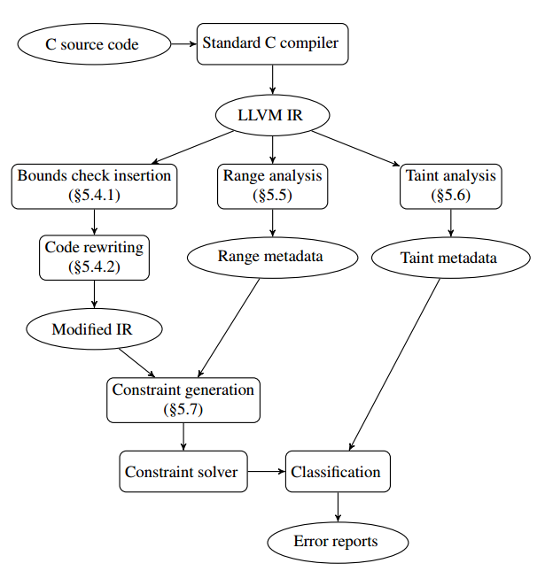
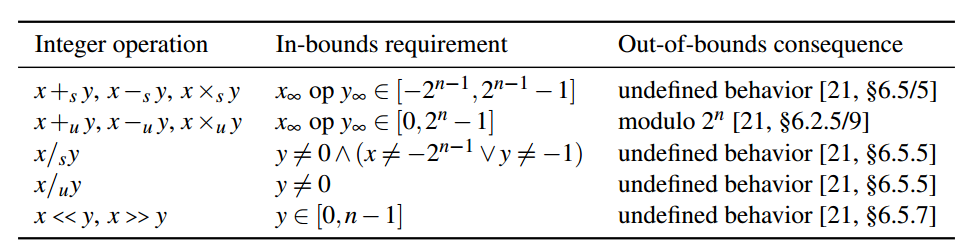
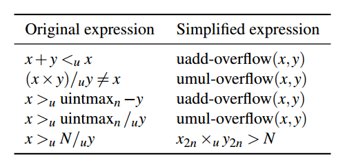
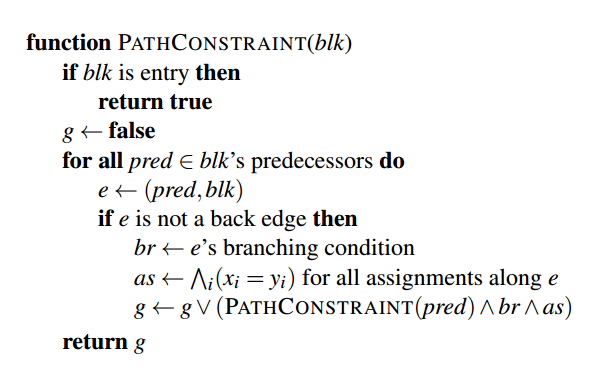
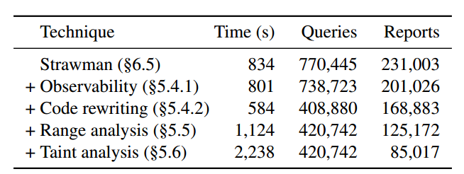

利用KINT提高系统的整数安全
==========================

摘要

整数型错误对系统安全造成很大威胁，因为它们可能导致缓冲区溢出或者提权等漏洞。本文提出了KINT，使用可扩展的**静态分析**来检测C代码中的整数错误。KINT从
源码和用户注释中生成约束，提供给约束求解器来检测是否存在整数型错误。KINT引入许多的技术来减少错误报告的数量。KINT
在 Linux 内核、lighttpd web 服务器和 OpenSSH
中识别了超过100个整数错误，并且被开发者确认且修复。基于KINT的经验，本文进一步提出了一种新的具有NaN语义的整数族，帮助开发者避免C程序中的整数错误。

1 简介
======

整数错误包括：算数溢出，除零，超出移位，有损截断和符号误读，这些可能被敌方所利用。

整数溢出占可能被误用以破坏内核并获得root权限的漏洞三分之一以上。

本文主要贡献：

1.给出了一个对整数错误的实用定义, 避免报告常见的溢出检查习惯用语

2.为KINT介绍了一个整体程序分析，它可以捕获某些不变量（约束），可扩展到大型程序，减少误报数量。

3.自动化分析仍会产生大量误报，所以引入人工范围标注，允许程序员通知KINT更复杂约束。

4.引入了面向C的检查溢出整数族，帮助程序员写正确代码。

5.为Linux内核的内存分配提供了不太容易出错的API

KINT方法比较通用，我们还将其用于lighttpd web服务器和OpenSSH并发现了bug。

论文结构：2，KINT和以往工作的区别；3，一个关于Linux内核中整数错误案例研究；4，概述了处理整数错误的几种方法；5，提出了KINT生成约束的设计，包括KINT的整数语义；6，使用Linux内核和已知的CVE案例评估KINT；7，提出了NaN整数族；8，总结结论。

2 相关工作
=========

静态分析
--------

不需要测试输入的可用性，但无法触发错误，存在误报。

静态分析工具，符号模型检查：prefix+Z3、KLEE、LLBMC、SmartFuzz和IntScope。这些工具在大型程序中存在路径爆炸。

KINT通过在单个函数级别执行约束求解，并为每个整数操作静态生成单个约束，避免路径爆炸。（受到Saturn启发）

PREFIX+Z3是微软的工具，存在路径爆炸问题。

验证工具ArC和Fram-C’s
Jessie插件，只接受某些C的子集（如没有函数指针），不能应用到Linux内核。

运行时检查
----------

优点是误报较少。

在代码生成时插入检查。

工具：GCC的-ftrapv，RICH，Archerr，IOC，blip，IntPatch，PaX的溢出GCC插件。

二进制文件插桩

工具：IntFinder，UQBTng

动态方法覆盖率低。KINT是静态检查器，不存在该问题。

库和语言支持
------------

为避免整数错误，可以使用带错误检查的整数库。如CERT的IntegerLib和SafeInt。不幸的是这些库也有错误。

Ada提供了语言支持定义范围子类型，超出范围则引发异常，开发者负责处理异常。本文NaN整数族受该思想启发。

案例研究
--------

整数溢出研究很多，但是我们还不知道任何详细的整数错误和它们对完整操作系统影响的研究，我们在下一节提供。

3 案例研究
==========

3.1 方法
--------

利用KINT对Linux进行分析，生成125172个错误报告，然后进行排序。

3.2 分布
--------

内核、设备驱动程序、文件系统和网络协议。

3.3 整数错误的不正确修复
------------------------

1不正确的边界

2格式错误的检查

3符号误解

4未定义的行为

3.4 影响
--------

可能被用来提权，导致内核挂起、Dos或者缓冲区溢出。

4 问题和方法
============

方法一：避免那些由于固定位宽度的算术导致整数计算操作偏离其数学意义上所期待的计算值的情况。这类方法会造成性能损失。

方法二：使用静态分析。这类方法的关键在于扩展到大型系统中，实现良好的覆盖率并减低误报数量。（KINT第五章）

我们为Linux内存分配提供了kmalloc\_array函数。

5 设计
======

本节介绍KINT的设计和帮助KINT减少大型系统错误报告数量的技术。

5.1概述
-------

KINT第一步使用标准C的编译器（如Clang）将c源码编译为LLVM中间表示（IR）。随后对IR进行三个不同的分析。

第一个分析，函数级分析。对IR进行检测，捕获每个单独函数可能发生整数错误的条件。KINT以两种方式推断出整数错误：1.查找某些表达式，在C中与数学预期不同。2.查找可能违反某些约束的值。（例如负数索引、控制条件重复真或者假，程序员提供的约束）

第二个分析，范围分析。推断函数之间共享值的范围约束（如，参数、返回值和共享数据结构）。

第三个分析，污点分析。污点跟踪确定哪些值可能在敏感的上下文中（如内存分配）使用。

基于函数级和范围分析的输出，KINT生成一个可能发生整数错误的约束，并将它们送给约束求解器，以确定是否可以触发该整数错误，如果是则求解。最后，KINT输出所有触发整数错误的用例作为约束求解的报告，在其中加入污点分析的注释，以指示错误的潜在严重性。

KINT的工作流（椭圆代表数据，矩形代表不同阶段）

5.2 在Linux上使用KINT
---------------------

将23个函数（如memcpy）中代表数据大小的参数定为非负，例如（memcpy，3）表示memcpy的第三个参数代表数据大小。KINT将检查它是否为非负。

为进一步减少错误报告数量，程序员可以在变量、函数参数和返回值上添加范围标注，添加人为约束。

为帮助确定哪些报告是可利用的，程序员可以对某些不可信的源和敏感的接收器进行标注。对Linux内核，我们标注了20个不可信的来源。

5.3 整数语义
------------

有符号范围[-2n-1,2n-1-1]，有符号范围[0,2n-1]。超出范围的操作违反了算数预期，则认为是错误。

加、减、乘，数学结果应在可表示的整数范围内。

除，除数不为0。

移位，移位最多n-1位，认为x\<\<1始终在范围内，而x\*2不是。

转换，转换不标记为错误，如果结果违反了某些约束（如负数的数组索引），则认为是错误。

5.4 函数级分析
--------------

在函数级别检测候选整数错误。

5.4.1 边界检查插入

为避免误报，KINT仅当溢出值可观察时才报告错误。可观察：该值被传递给另一个函数，被用来进行内存加载、存储，或者导致未定义的行为（例如除零）。

在IR级别，KINT通过在特殊函数kint\_bug\_on中插入调用来标记潜在的整数错误。该函数返回bool值，然后调用求解器判断该参数是否为真，并生成错误报告。例如x/y，KINT插入kint\_bug\_on(y==0)。

KINT也调用kint\_bug\_on，为硬编码在KINT或者被程序员指定的约束：

数组索引：kint\_bug\_on（x\<0）

数据大小：kint\_bug\_on（x\<0）

对于不能表示为调用特殊函数的控制流条件的情况，KINT单独生成约束。

5.4.2 代码重写

为减少误报、提高性能，KINT在IR上执行一系列的代码转换。

1.简化常用的检查。

精确的整数检查将生成复杂的约束，很难求解。使用LLVM内置溢出检查函数进行等效表达式替换。简化生成的约束。

2.简化指针计算

KINT把每个指针和内存地址表示为符号表达式，并进行简化。减少了误报。

3.合并内存加载

KINT使用了简单的内存模型：从加载指令返回的数据是无约束的，KINT更进一步合并加载指令减少误报。

4.编译器优化消除检查

每个边界检查插入的kint\_bug\_on，如果总是计算错误优化器将删除它。使用LLVM的优化器可以帮助避免后来的约束求解。

5.5 范围分析
------------

为了扩展到Linux内核等大型系统中，KINT采用了跨函数的约束收集。KINT为每个跨函数实体维护一个范围，最初，不可信实体置为全集，其余全为空。迭代更新范围表：KINT扫描每个函数，当遇到跨函数体时，KINT从表中检索该实体范围。函数内KINT使用范围算数进行传递。相应的范围表项将根据以前范围和传入值的范围进行合并更新表内容。

跨函数传播范围，KINT需要系统内的调用关系图。为此，KINT以迭代方式生成调用关系图。

KINT范围分析假设了‘严别名’的规则：同一内存空间不能被不同类型访问。

在范围表收敛或（更可能）一个固定次数的迭代后，范围分析将停止更新范围表，由约束生成器生成更精确的约束并传递给求解器。

5.6 污点分析
------------

为帮助程序员关注高风险的报告。KINT污点分析通过判断错误报告数据是否来自不可信或者在敏感上下文中使用对报告进行分类。类似范围分析进行函数间传递污点信息。

KINT硬编码一个敏感的上下文：tautological
comparisons。其他敏感点由程序员定义（5.2节）。

5.7 约束生成
------------

**生成错误约束**

根据上文已经修改注释IR生成错误约束，kint\_bug\_on可能返回真则生成一个错误约束；为了检查导致tautological
comparisons的整数，KINT从每个控制流比较操作中生成错误约束：如果表达式总是正确的或者总是错误的，KINT报告错误。

**生成路径约束**

将两者求与，送入求解器求解。

路径约束生成算法

对于有循环的，之展开一次循环体。

为缓解循环展开减少的约束，KINT将循环内的约束移动到外部（可能的话）。

KINT调用Boolector提供的API生成约束，减少了求解时间。

5.8 不足
--------

KINT不能检测以下整数错误：

KINT只能检测C语言，不能检测汇编语言。

KINT不检测已知约束没限定的转换错误（5.4.1）

KINT以不安全的方法合并加载项，可能导致不能检测别名。

KINT仅展开一次循环体，不能检测多次循环引起的错误。

6 KINT评估
==========

评估以下问题：

KINT可以发现系统中新的整数错误吗？

KINT的报告完整性如何？

什么导致了KINT的误报，什么样的人为标注可以避免这些误报？

KINT分析像Linux这样的大型系统需要多长时间？

KINT减少误报数量的技术如何？

6.1 新bug
---------

从Linux内核v3.1到v3.4-rc4。被开发者确认并修复了105个错误。在两个用户态应用中使用了KINT，lighttpd和OpenSSH，分别修复了1个和5个整数错误。显示了发现新bug的有效性。

6.2 完整性
----------

对37最近三年个已知CVE进行检测，KINT发现了37中的36个错误。因为循环展开问题，没发现其中的一个。

6.3 误报
--------

为了搞清楚什么引起KINT误报，做了三个实验：

1.
CVE实验：在6.2中已经修补的代码中进行实验，37个中的33个没有报错，4个报错。一个是修复完有额外的整数错误，两个是不正确的修复，另一个是误报。误报原因是存在一个KINT未知的隐式规则。

2.
全内核报告分析：对整个Linux生成了125172个警告。过滤敏感点后，999个与内存分配相关，741是不信任的输入。对这些进行了人工分析，第一次分析了97个bug发现首批6个可利用的bug。第二次分析741个bug报告，发现了11个可利用的bug。

3.单模块分析

6.4 性能
--------

KINT在160分钟分析了8916个文件：33的Clang编译，87分钟的范围和污点分析，37分钟生成约束求解420742个请求，其中3944个请求超时（1秒）。其他时间可以忽略，证明KINT可以在合理时间分析大系统。

6.5 技术有效性
--------------

7 NaN整数语义
=============

为帮助程序员编写正确代码，提出了nan语义整数族：一旦整数超出界限，就停留在特殊的nan状态中。

8 结论
======

设计实现了KINT，可扩展性强的整数错误静态分析工具。修复了Linux内核、lighttpd、OpenSSH中的100多个整数错误。减少了误报数量。提出了NAN整数族。
