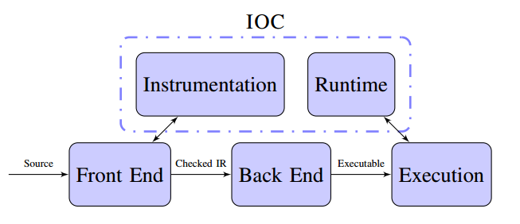
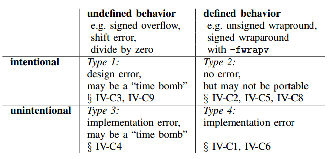

**理解C/C++中的整数溢出**
========================

摘要

C和c++中整数溢出是很难追踪，而且可能会导致严重的错误或者可利用的漏洞。虽然发现这些bug的工具已经存在，但是情况仍然是很复杂，因为不是所有的溢出都是bug。我们需要更好的工具，因为还没有一个关于这个方面的彻底理解。我们开发了IOC，整数溢出动态检查工具。使用该工具首次实现了对C和C++整数溢出漏洞的产生流行性和模式进行了详细的实证研究。结果显示，环绕行为的故意使用比广泛认为的更加常见。比如，SPEC
CINT2000基准中存在200个明显的位置发生了溢出。虽然很多溢出是故意的，大量的意外溢出也有发生。根据程序员意图，溢出在定义和没定义的使用方法都有发生。应用执行没有定义的操作可能被或者已经被编译器优化所破坏。通过SPEC，我们发现并报告在SQLite、PostgreSQL、SafeInt、GNU
MPC和GMP，Firefox，GCC，LLVM，Python，BIND和OpenSSL中没有定义的整数溢出。很多已经被修复。我们的结果显示，C和C++中的整数溢出是微妙且复杂的，它们在常用的程序中很常见，开发者对它们普遍存在误解。

关键词：整数溢出，整数环绕，未定义行为

**I. 简介**
===========

整数溢出可能会造成严重的漏洞。

使用编译器插入运行时检查，检测整数溢出是相对简单的。但是很多溢出并不是bug，因为程序员可能会故意使用代码环绕来实现某些功能。如果此类情况很少，基于编译器的方法是有效的，如果不少，则需要跟复杂的技术来区分有意和无意的用法。

现有文件并没有研究良性的、有意使用整数溢出（或者环绕）的模式。不能回答以下问题：

1.数字错误在常用的C和C++程序中的常见程度如何？

2.使用有符号类型的故意环绕操作常见程度如何，这种类型存在未定义的行为，目前的编译器可以编译这些溢出形成正确的代码。我们把这些溢出称为“定时炸弹”，以为编译器升级可能将他们变成错误。

3.对无符号整型的良好环绕操作有多常见？

本文主要贡献：

1．开发了整数溢出检查器（IOC），用于检测C和C++中未定义整数行为和良好定义的环绕行为。

2．首次进行了详细的实证研究：针对SPEC 2000，SPEC
2006和大量流行的开源应用。该部分研究包含了大量关于故意使用环绕的手动分析。

3．使用IOC在流行应用中发现了位置溢出错误。包括SQLite、PostgreSQL、BIND、火狐等等。

研究的主要发现：

1.有意和无意、定义明确和为定义的整数溢出，四种组合都在整整代码中经常出现。

2.整数溢出是非常微妙的，专家也会出错。

**II. C和C++中的溢出**
======================

定义良好的行为
--------------

一些无符号整型的环绕行为是定义好的，而且可移植（在不同实现中都一样）；另一些定义好的溢出不可移植，依赖于不同的实现，例如0U-1.

未定义的行为
------------

某些类型的整数溢出是未定义的。

1.静默破坏，当程序执行未定义操作时，编译器优化可能会悄悄的破坏他们。

2.定时炸弹，当编译器升级时可能会发生破坏。

3.可预测性的错觉，一些编译器在某些优化级别上对某些未定义操作有可预测行为。

4.非正式方言，某些编译器支持比标准更强的语义。

5.不标准的标准，某些溢出在不同版本的标准改变了含义。

**III. 工具设计和实现**
=======================

IOC主要包含两部分：编译时插桩转换和运行时处理程序。

插桩转换：是一个添加数字错误检查的编译器遍（pass），实现方法是在Clang中扩展大约1600个LOC。

IOC的架构

A. 插桩遍放在哪里？
-------------------

放在Clang的抽象语法树（词法分析、类型检查、隐式类型转换）之后。

B. 溢出检查
-----------

移位溢出检查简单

算数溢出比较复杂：

1.先决条件测试

2.CPU标记测试

3.宽度扩展后置条件测试

C. 运行库
---------

D. 整数溢出检查的运行开销
-------------------------

**IV. 整数溢出研究**
====================

整数溢出分类

**V. 已有研究**
===============

**VI. 结论**
============
