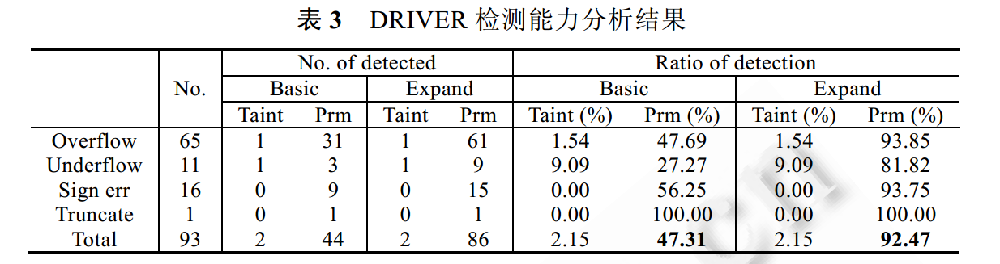

基于信息流的整数漏洞插装和验证
==============================

为降低整数漏洞插装验证的运行开销，提出基于信息流的整数漏洞插装方法。从限定分析对象范围的角度出发，将分析对象约减为污染信息流路径上的所有危险整数操作，以降低静态插装密度。在
GCC 平台上，实现了原型系统 DRIVER。

1 相关工作
==========

整数漏洞研究分为4类：

（1）预防：CCured、safeInt、AIR model、IntegerLib

（2）动态检查：SmartFuzz、KLEE、Exe、Cute、Dart

（3）静态检查：Sarkar‘07、IntScope

（4）静态插桩：RICH、IntPatch、IOC

2 基于信息流的插桩和验证
========================

基于信息流的整数漏洞判定：信息流if各路径上实体的安全级均初始化为⊥，根据传播模式T和转换规则f，如果有TM导致的污染数据没有被TC清除，且经过TR的传递后流向了TS，影响到程序的安全性产生敏感数据，并且敏感数据经SR的传递后被SV触发，既可以判定其为整数漏洞。

静态分析阶段在代码中插装动态验证代码。插装原则：

（1）针对可能发生溢出的算数运算，基于CPU标志位的发生后检查。

（2）针对可能造成符号错误和阶段错误的整数操作，插装发生前检查。

（3）针对移位操作插装发生前检查。

3 实现
=======

原型工具DRIVER架构

**总体介绍**：在GIMPLE的优化趟（pass）链表中嵌入信息流提取、约束求解、验证代码插装。首先，提取（污点-\>安全性操作）信息流；然后，对危险整数操作进行安全约束求解；随后，对潜在整数漏洞进行指令级的插装；最后，得到可执行文件。

实现中的一些问题：

1.信息流提取模块：首先，在SSA中间表示（静态单一赋值）和控制流图基础上抽取直接信息流，构造直接信息流图DFG，然后，在函数条用途和过程优化机制的基础上，提取过程中所有的污染路径taint-src-\>taint-sink。

2.编译单元的影响

模块化编译，编译器会将多个源文件划分到不同的编译单元，如果一条过程间信息流的源节点和目的节点分布在不同的编译单元内，无法将二者连接起来，产生漏报。为此，实现不同粒度分析。在完整的编译单元内的进行过程分析，成为taint粒度；流出其他编译单元的信息流集合和其他编译单元引入的污染信息流集合被保守认为污染路径集合，称为prm粒度。

3.污染地址问题

内存是污染的，其地址是否需要标记为污染。实现不同分析粒度：basic粒度和expand粒度。

4 性能评价
==========

1.漏洞检测能力

选择2008-2011的93个已知漏洞，包括开源Linux, Apache, PHP, Python, GLIBC, GIMP,
Jasper等。

Expand-prm模式检测能力最强，检出92%，有7个未检出。并与RICH比较，相当。

2.插桩密度

大约每92行插桩1次，优于RICH的23行插桩1次。

3.污染地址敏感的影响

4.额外性能开销

平均开销3%，优于RICH。

5.新发现漏洞

发现11个可能漏洞，提交CVE。
