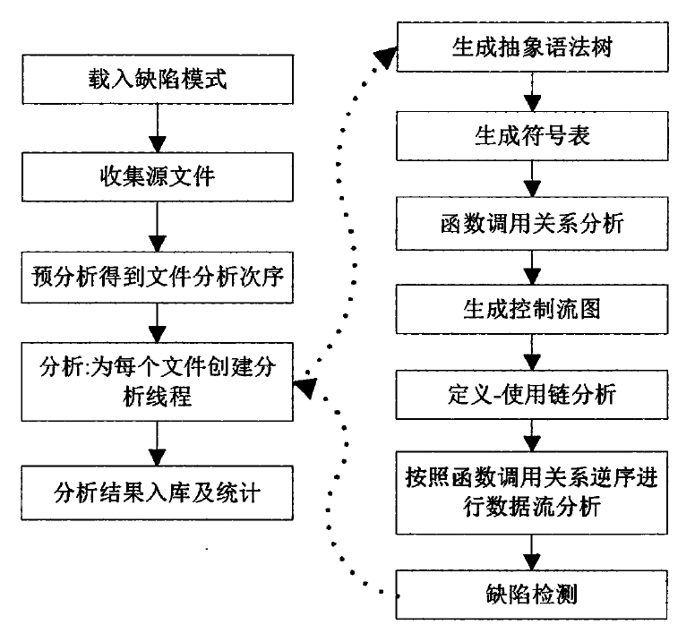
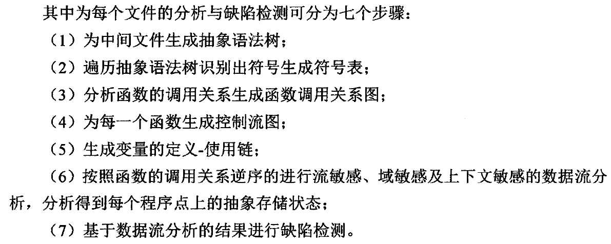
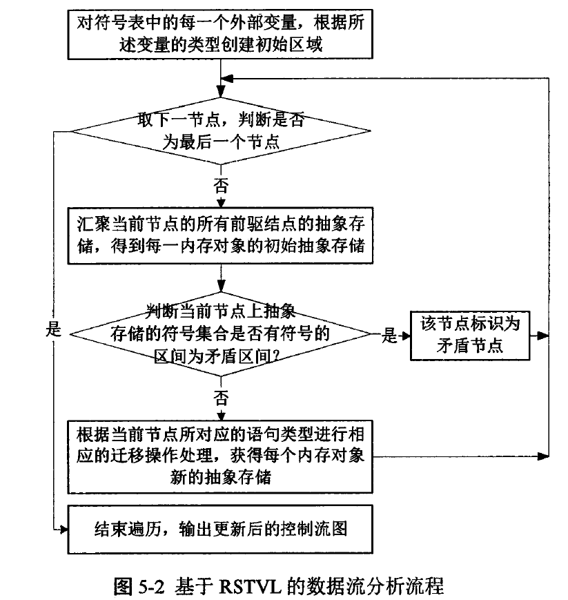

空指针引用缺陷充分性检测技术研究
================================

董玉坤 北邮博士

摘要
====

本文针对C程序的数据流分析与空指针引用缺陷检测的几个关键性问题进行了研究，主要工作：

1.可寻址表达式的充分识别。

2.应用基于区域的符号化三值逻辑(RSTVL)描述内存对象的存储状态。

3.基于RSTVL的数据流分析。

4.基于符号化函数摘要的过程间数据流分析。

5.空指针引用缺陷的充分检测。

第一章 绪论
===========

第二章 空指针引用缺陷检测概述
=============================

1.静态分析技术
--------------

抽象解释、符号执行、模型检测、定理证明、类型推导、基于缺陷模式的测试。

2.数据流分析技术
----------------

格，经典的迭代算法。

3.指针分析技术
--------------

指针分析的目标是确定每个指针在运行时的指向。

指向信息的表示形式：storeless方法和store based方法。

影响指针分析精度因素：

流敏感分析/流不敏感分析：过程内分析是否考虑语句执行顺序。

上下文敏感分析/上下文不敏感分析：过程间分析是否考虑过程调用的上下文信息。

域敏感分析/域不敏感分析：复杂数据结构分析是否把每个成员变量都是做不同的存储对象。

路径敏感分析/路径不敏感分析。

4.空指针引用缺陷检测
--------------------

空指针引用缺陷检测：控制流前向分析。

空指针引用验证：控制流后向分析。

空指针引用缺陷能否充分测试，三个因素：能否识别出全部指针与指针引用，数据流分析与指针分析是否可靠，指针引用的为空判定是否全面。

5.静态缺陷检测工具DTSC
----------------------

作者团队开发，产品网站：http://www.dtstesting.com

一个面向具体缺陷模式的静态缺陷检测工具，过静态地分析程序源代码能够测试故障类、安全类、疑问类与规则类等共100多种缺陷，系统架构图如下。

DTSC框架

DTSC整体分析流程

6.缺陷漏报因素分析
------------------

导致语义类缺陷漏报的因素：

(1) 对变量的存储状态描述不全面。

(2) 数据流分析不可靠。

(3) 未定义相应的缺陷模式。

(4) 缺陷检测对象识别不全面。

(5) 语义缺陷判定规则不正确。

本课题实现了改进的系统DTSC\_RSTVL。

第三章 可寻址表达式的充分识别
=============================

表达式的左值是指它代表的内存对象的地址，表达式的右值是指对表达式求值所得到的值。

进行数据流分析必须充分的识别出具有左值的表达式，推导出其数据类型、作用域、与其它表达式的关联等属性信息。

1 目前表达式识别不足
--------------------

(1)
不能保证识别出程序中所有的具有左值的表达式，通常会被测试程序在语法上进行约束。

(2)
对不同编译器所支持的不同语法规则缺少可扩展性，会导致对某些编译器的语法不能正确解析。

(3) 对数组下标是非常数表达式，指针算数中出现非常数的整型表达式的表示不准确。

本文提出了“可寻址表达式”的概念。

2 可寻址表达式
--------------

第四章 基于区域的符号化三值逻辑
===============================

存储状态是内存对象在程序点上状态的集合。

1 当前抽象存储模型的不足
------------------------

(1)
不能全面的描述可寻址表达式间的所有关联，未考虑层次关系与指向关系将不能保证分析的可靠性，未考虑取值逻辑关系将影响分析的精度。

(2)
抽象域未能统一表示基本类型变量的值信息与指针变量的地址信息，导致难以将指针指向统一在数据流分析框架下。

(3)
未能很好的同时支持数据流分析、指针分析与形态分析，导致不能全面准确的确定可寻址表达式对应的内存区域。

(4)
对上下文敏感的过程间数据流分析支持不够，主要是被调函数中的值信息与地址信息难以映射到调用点处的值信息与地址信息。

(5) 难以准确的描述动态分配内存。

本文提出了基于区域的符号化三值逻辑RSTVL。

2 基于区域的符号化三值逻辑RSTVL
-------------------------------

第五章 基于RSTVL的过程内数据流分析
==================================

1 目前对C程序分析不足
---------------------

(1) 未能全面的描述变量的存储状态

(2) 对域敏感分析考虑的不够，导致对复合数据结构处理不够精确

(3) 未将数据流分析与指针分析、形态分析有效的结合起来。

2基于RSTVL的过程内数据流分析
----------------------------

第六章 基于符号化函数摘要的过程间数据流分析
===========================================

1 目前符号化函数摘要存在不足
----------------------------

(1)
难于实现域敏感的过程间分析，大多数方法不能够全面的描述可寻址表达式间的层次关系与指向关系。

(2)
在同时实现值信息的数据流与地址信息的数据流过程间的分析中，不能很好的同时处理值信息与地址信息的过程间分析。

2 符号化函数摘要
----------------

将函数的行为用符号进行表示，并根据调用点的上下文环境对符号进行实例化以实现对符号化函数摘要的实例化，进而实现对调用点状态的更新。

基本思想：

首先对全局变量与形参进行初始化；然后根据过程内数据流分析的结果，计算返回语句的符号表达式；最后将函数出口节点的各个前驱节点的全局变量及形参的抽象存储信息添加到函数摘要中，符号化的函数摘要存放于一个全局环境中。

在每个函数调用点，取出被调用函数的符号化函数摘要，并根据调用点处的上下文信息对符号化函数摘要进行实例化，实现对调用点处的抽象存储更新。

第七章 空指针引用缺陷充分性检测
===============================

空指针引用缺陷能否充分测试，三个因素：能否识别出全部指针与指针引用，数据流分析与指针分析是否可靠，指针引用的为空判定是否全面。

1 过程内空指针引用缺陷检测
--------------------------

(1) 指针引用识别

DTSC\_RSTVL生成被测文件的抽象语法树，搜索AST获得每个被引用的指针。

(2) 指针指向属性

用来判定指针是空指针：NULL，NON，EMPTY，NONNULL。

(3) 指针引用判定规则

2 过程间空指针引用缺陷检测
--------------------------

(1) 函数摘要前置约束

(2) 前置约束生成

(3) 前置约束实例化

3 空指针引用缺陷检测算法
------------------------

a.识别出被引用的指针

b.根据在调用点上的抽象存储获得该指针的指向属性

c.如果属性不是UNKNOWN或EMPTY，则根据指针引用判定规则进行判定；若为UNKNOWN，则将该指针所关联的外部指针添加到该函数的空指针引用前置约束中。

4 实验验证
----------

(1) 空指针引用缺陷检测对象识别

(2) 空指针引用缺陷检测对比实验一

与DTSC8和Klocwork9对5个工程的空指针引用检测，评价指标错误数(IP)、实错数(Bug)和相对漏报(RFN)。DTSC8、Klocwork9和DTSC\_RSTVL的误报为：47%，24%，38%，相对漏报为18%，61%，0%。

实验证明了方法极大降低空指针引用缺陷的漏报。
