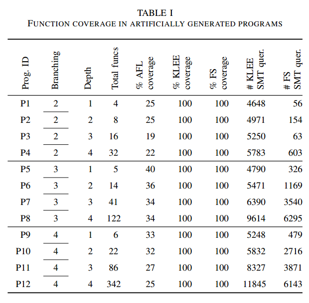
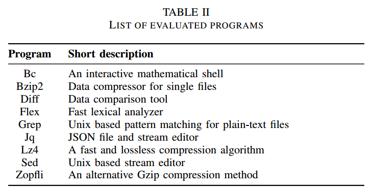
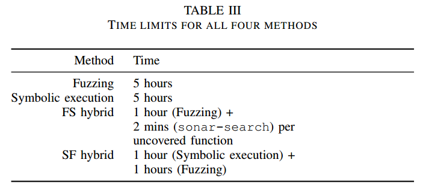
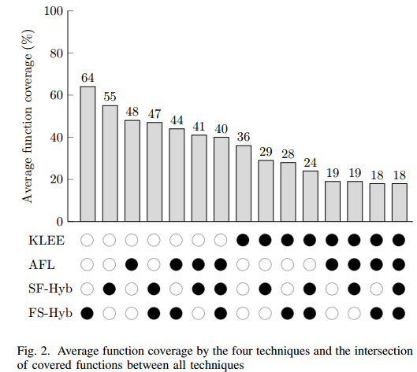
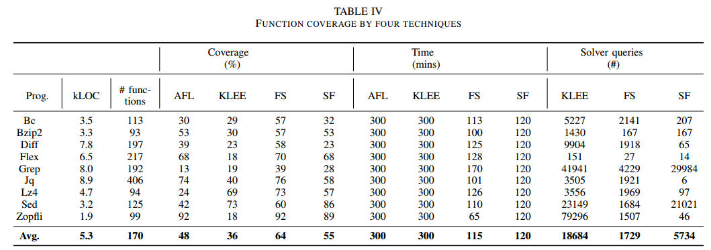
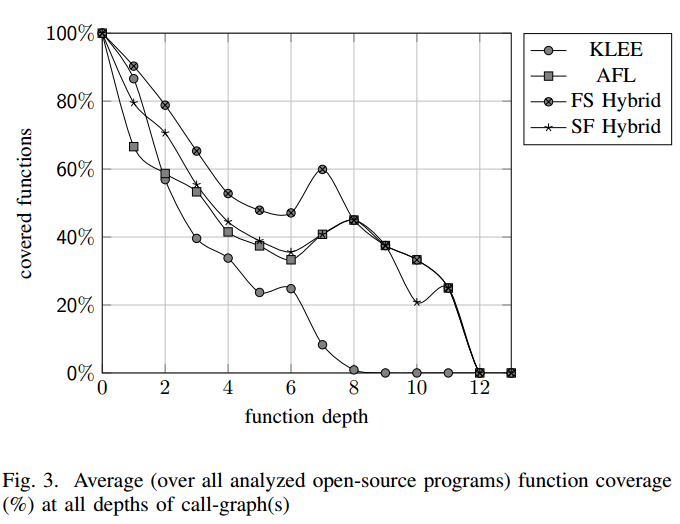

使用Munch提高函数覆盖率：一种Fuzzing和导向式符号执行结合的方法
==============================================================

摘要
====

结合fuzzing和符号执行可以得到比单独技术更高的“函数覆盖率”。本文提出了Munch(开源)，是结合这两种技术的开源框架。在九个大型开源程序进行实验，Munch取得了比单独fuzzing和符号执行更高的函数覆盖率。使用基于总体分析时间和SMT求解器queries数量作为度量，我们展示了Munch在获取更高的函数覆盖上更加有效的。

1 简介
======

Fuzzing和符号执行通常覆盖率较低，包括在源代码，二进制，中间代码或者组件层面。组件是软件基本的组成单元，例如类、函数。低覆盖率容易发生在经过调用链才能到达的组件，或者复用组件（如开源API或者由不同团队开发的）。

根据系统可用性信息，多数自动化漏洞发现可以分为两类：黑盒测试、白盒测试。Fuzzing是典型的黑盒测试，忽略测试系统的实现，随机生成测试用例，可能会导致一些距离程序入口点很近的路径无法被执行。符号执行（例如：动态符号执行或者白盒fuzzing）是典型的白盒测试。但是它依赖SMT求解器，路径爆炸问题，可能在浅层就stuck。

本文介绍一种组合Fuzzing和符号执行的框架，提升对C程序的函数覆盖率。符号执行选择KLEE，Fuzzing选择AFL。其中，使用了一种导向式搜索策略增强了KLEE。

**问题：**Fuzzing和符号执行的覆盖率都不高。

**解决方法：**结合两种技术，

1）使用fuzzing进行初始的程序搜索，然后使用符号执行搜索fuzzing没有发现的函数。

2）使用符号执行生成一个不同函数的测试用例集合，被用来fuzz程序。

**贡献：**

1 在KLEE中实现导向式搜索，达到任意函数入口。

2 实现两个混合方法，减少符号执行工具的queries数量，缓解SMT求解器的瓶颈。

3 首次提供了针对真实程序的的实证评估。

4 开源项目。

2 动机
======

致力于更高效的到达更深的函数。

在人为构造的12个小程序中进行测试，AFL的覆盖率低，KLEE的覆盖率高但是SMT
queries数量多。

3 方法
======

分两个层次讲：模式和组件。

1 操作模式

a FS混合

表示Fuzzing+符号执行。首先在一定时间限制内进行fuzz，计算fuzz的函数覆盖率。然后使用导向式符号执行到达没有覆盖到的函数。该策略需要用户提供fuzz的种子输入，特别适用于基于文件等的输入。

b SF混合

表示符号执行+fuzzing。首先，在一定时间限制内进行符号执行，提供符号化的命令行参数、标准输入和文件输入。使用符号执行生成的输入作为fuzz的种子输入，进行fuzz。

2 Munch组件

a fuzzing组件：AFL

b
符号执行组件：KLEE的策略优先搜索未访问的路径。SF模式，调用优化后的KLEE发现新的未知路径。FS模式需要一个导向式策略搜索到任意函数入口点。本文在KLEE中扩展了该导向式策略。

在他人导向式符号执行的研究基础上：

(1)为了计算最短距离，将源代码作为输入修改为控制流图和调用图作为输入。

(2)当一个状态已经到达目标函数后，后续状态使用KLEE的启发式搜索。完整的策略命名为sonar-search，在klee22中实现。

c 管理组件：Orchestrator。调度符号执行和fuzzer的组件，具体包括：

(1)从LLVM字节码中提升调用图（仅关心main函数可达）。

(2)对函数列表进行拓扑排序。

(3)开始Munch时，读取本地的JSON格式配置文件，确定是否依赖本地输入(FS或者SF)。

(4)如果程序接受命令行参数，将命令行参数转换为标准输入。

(5)初始化fuzzing(FS模式)或者符号执行(SF模式)。

(6)如果是FS模式，读取afl-cov覆盖信息计算未覆盖函数列表，进行导向式的目标。

(7)如果是SF模式，读取KLEE测试用例，并populate测试用例位置。

(8)初始化符号执行(FS模式)或者fuzzing(SF模式)。

(9)计算函数覆盖率。

4 评价
======

设计实验评估我们方法的函数覆盖率、深度覆盖率和调用SMT求解数量，将其和纯符号执行、fuzzing进行比较。

1.  实验

为了验证方法有效性，如图，使用9个开源C语言项目进行评估。分别执行了FS模式和SF模式。在FS模式中，为AFL手动构造了种子输入。在SF模式中，手动检查程序，聚集关于命令行参数，标准输入或者文件输入的长度的最小需求。最后，为比较，纯符号执行使用KLEE，纯fuzz使用AFL。

四种模式的最大时间限制如图。

2. 结论

(1)有效性

a.函数覆盖

如图，每种方法的平均函数覆盖率及交集比例。SF和FS两种混合方法覆盖率最高，虽然有些AFL和KLEE能覆盖的函数混合方法没有覆盖，但是混合方法覆盖但AFL和KLEE没有覆盖的函数更多。

b.覆盖深度

调用图的深度定义为从main函数到当前函数的边的数量。

上图显示了所有被分析程序在所有深度上的平均函数覆盖。1)符号执行在低深度函数覆盖高，高深度函数覆盖最低。2)fuzzing覆盖随函数深度增加而减少，但是中间有上升几乎和混合方法重合。3)混合方法FS和SF覆盖也随深度增加而减少，但是减少速度比单纯的符号执行和fuzz要慢。

(2)效率

a.在手动构造程序中的效率。回顾第2节，fuzzing覆盖率低，符号执行和混合方法都能达到100%覆盖，但是混合方法比符号执行调用SMT的次数要少，而且求解的约束也要简单。

b.SMT求解请求和分析时间。

(3)总结

a.FS和SF混合方法比单独符号执行和fuzzing整体覆盖率高

b.混合方法比单独符号执行和fuzzing深度函数覆盖率高

c.SMT求解数量平均减少80%

d.使用Munch提升了发现深度漏洞的概率

3. 讨论和局限性

5 相关工作
==========

(1)Fuzzing

黑盒测试，当前学术和工业界流行的工具AFL，使用遗传算法提升路径覆盖率，发现漏洞。

(2)符号执行

白盒测试，面临两个问题：路径爆炸和低效率的约束求解。部分符号执行（如函数内）独立分析程序的一部分，减少路径爆炸。

(3)混合方法

本文和其他混合方法不同的是有两种模式。2007早期混合方法有将符号执行和随机测试结合。2015提出了一种混合方法，当fuzzing不能提高二进制程序基本块覆盖率时使用符号执行提高二进制覆盖宽度。我们的FS改进了这种方法，通过符号执行没有覆盖的基本块和函数，防止已经被fuzzing覆盖过的基本块。2012年，提出了一种类似SF的混合策略。2010年，提出了一种混合方法处理校验和。2016年提出了一种混合策略发现程序的深度漏洞，不同的是，符号执行搜索策略是被可能有潜在漏洞的路径所导向，而本文是使用函数覆盖率来导向。2016年提出了一种白盒fuzzing策略，MoWF。上述都不开源。

2016年提出了Driller，非常接近本文框架，但是他们的符号搜索策略是被输入污点分析导向的，而不是目标导向策略。因为Driller依赖fuzzer的输入，而不是每次计算感兴趣的集合，所以不能保证较高的函数覆盖率。并且driller开源代码依赖于作者特定的分布式系统。

6 结论
======

本文开发并评估了Munch，一种基于符号执行和fuzzing的混合框架，该框架针对函数覆盖率。该框架有两种模式：先fuzzing后导向式符号执行；先符号执行作为fuzzing的种子输入。在12个手动构造的程序和9个开源程序中进行实验，验证了我们的方法的覆盖率高，时间开销小。
