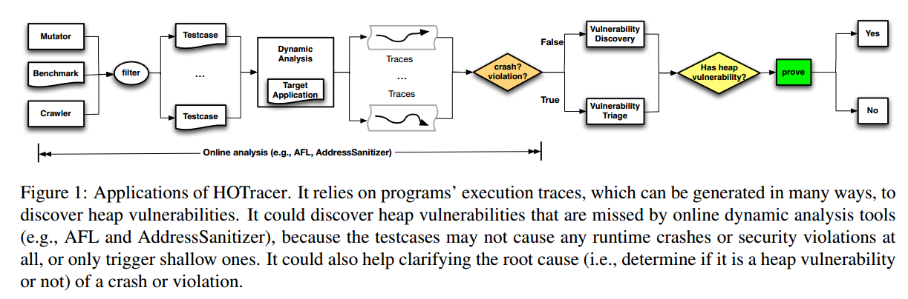
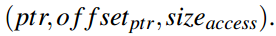
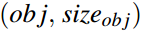
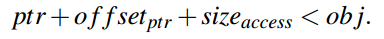
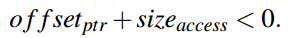
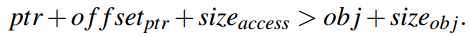
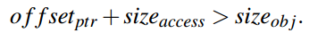
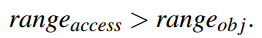
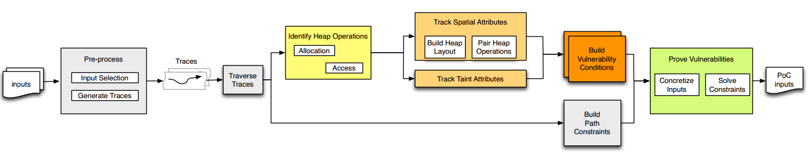
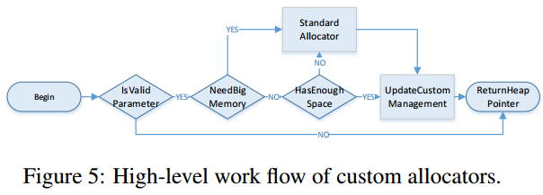

高效的堆溢出发现技术
====================

**摘要**
当前堆溢出漏洞主要关注运行时检查，需要大量输入来达到高代码覆盖的目的，这种方法存在偶然性，虽然可能执行了存在漏洞的路径，但没有触发漏洞，并且，因为不完整的漏洞模型导致堆漏洞漏报。本文提出HOTracer来发现潜在堆漏洞。定义堆溢出模型：堆分配和访问操作的不一致性。对程序执行迹进行了深度离线分析，识别堆溢出。结合一些优化，能够高效地发现二进制程序中难以触发的堆溢出。实现了原型系统HOTracer，在17个真实应用中进行评估，发现了47个未知堆溢出漏洞。

1.简介
======

25%的windows
7攻击使用了堆溢出漏洞。堆中存放了堆管理元数据等敏感数据和虚函数调用等敏感指针。攻击者可以使用堆喷射或堆风水技术构造堆布局实施攻击。现有堆溢出保护方法：DieHard、Dieharder、Heaptherapy、HeapSentry。

存在静态、动态分析方法。别名分析、堆布局不确定性导致静态分析存在高误报，仅适用于小程序。具体执行中堆对象的空间关系是确定的，所以动态分析更容易检测堆漏洞。

在线动态分析是当前流行的方法。监测目标程序运行，检测违反安全规定或者程序crash来发现漏洞。如AddressSanitizer，在对象周围创建redzones，运行时跟踪可寻址字节，当不可寻址的redzone字节被访问检测堆溢出。Fuzzer(AFL)使用大量输入检测程序漏洞。这些方法都需要生成能够触发漏洞的测试用例，很难到达漏洞所在路径，即使到达可能不满足关键的漏洞条件不能触发。

离线分析能够全路径分析发现潜在堆漏洞。如，DIODE关注内存分配点整数溢出导致堆溢出，然后推理内存分配大小的约束发现漏洞。Dowser和BORG关注容易导致堆溢出的内存访问点，导向式符号执行覆盖可疑的访问指令缓冲区。这些方法都没有建立准确的堆溢出模型，会漏报堆溢出漏洞。

本文认为产生堆溢出的根本原因是堆分配和堆访问操作的不一致。例如，分配x+2字节的空间，写入x+1字节数据，如果x+2整数溢出而x+1没有溢出则会造成堆溢出。需要同时考虑堆分配和访问操作。

**本文提出了离线分析工具HOTracer，检查空间一致性，发现堆溢出漏洞。首先，记录程序执行迹，无论输入是否良构；然后，识别堆分配和相应的堆操作，并判断是否存在不一致性；最后，检查是否堆分配和堆操作能够被攻击者控制，若可以，收集路径约束和空间不一致性生成PoC触发漏洞。**

结合实用性和效率，解决一些挑战：1.大量执行迹需要分析，耗时，不能关注于高代码覆盖，而是使用代表性的输入。2.从大量二进制程序执行迹中识别堆操作，使用特征集识别堆操作。甚至很多用户自定义的内存分配和访问操作，对大量分配和访问操作配对也是挑战，将低级访问指令提升到高级堆访问操作减少分配、访问对的分析。3.生成触发堆漏洞的具体输入也是挑战，因为真实程序中执行迹规模和约束很复杂。HOTracer仅收集不影响漏洞条件的部分迹。

如图，HOTracer可以用来对动态分析工具产生的crash进行分类，或者对路径进行深入分析发现可能漏报的漏洞。本文贡献：

1.提出了离线动态分析方法，可以发现堆漏洞。

2.对堆漏洞建模：堆操作之间的不一致性。

3.解决了一些挑战，包括路径爆炸，堆操作对爆炸和约束爆炸，提高了可用性和效率。

4.实现了原型系统，可以处理大型实际程序。

5.在17个应用中发现47个未知漏洞。

2.背景
======

通过实例分析堆溢出漏洞的根本原因。

2.1实例
-------

堆访问操作通常通过一个堆指针和内存访问大小。指针有两个部分组成：指针基址和偏移。堆访问操作表示为

堆访问操作对象表示为内存范围，分配地址和大小。

分配地址通常是内存管理函数的返回值，而大小可能来自于用户输入，或者是足够大的常数，可能导致堆溢出漏洞。

2.2成因分析
-----------

堆溢出的根本原因在于堆访问偏移或者大小超过了堆的边界。下溢：

通常，ptr和obj相等，可表示为

上溢：

即：

两式归一化：

2.3观察结果
-----------

如果用户输入能影响堆分配或者堆访问，都可能满足空间不一致性，触发堆溢出漏洞。

3.设计
======

关注于动态分析发现堆溢出，不依赖测试用例直接触发，也不依赖源代码。为达到该目标，对程序执行迹离线分析。选择有代表性的测试用例生成一定数量的执行迹，对每对\<分配，访问\>操作对进行检查，并根据路径约束和漏洞约束求解具体输入。

3.1系统概述
-----------

离线分析堆对象的空间属性（如大小）和污点属性（受哪部分输入影响）。HOTracer的工作流程如图，首先，预处理样本输入，选择代表性输入；然后，引导动态分析模块为每个输入生成执行迹；每个执行迹进行离线深入分析。然后，识别堆分配和堆访问操作，建立堆布局。对同一个对象的堆分配和访问操作分组。

接着，HOTracer跟踪执行中的堆对象空间和污点属性，基于这些属性建立漏洞条件。最后求解漏洞条件和路径约束，生成触发漏洞的具体输入。

面临三挑战：1.大量执行迹分析。2.大量分配、访问对。3.实际应用中约束复杂。

3.2迹生成优化
-------------

分析程序所有执行迹是高开销并且没必要的，本文使用启发式方法，根据类型选择输入。对已知类型输入，解析输入结构，最小化测试用例集合覆盖所有子类，得到有代表性的执行迹。对于未知的文件类型，使用模糊测试生成种子输入，蒸馏输入最小化输入集合覆盖大部分代码块，得到代表性测试用例。

采取了PANDA中记录-重放机制低开销生成执行迹，记录阶段运行前保存系统快照，运行时记录变化，这种方法开销低。重放阶段，解释快照和记录恢复完整的执行迹。

3.3堆操作模型
-------------

通过分析堆分配函数可以获得堆的大小、地址，但是识别所有堆分配函数具有挑战。除了标准堆分配函数，用户也会自定义分配函数如Jemalloc等，图5表示自定义分配函数的一般工作流，通过以下模式进行识别：

A 堆分配函数返回堆区域指针。

B1 自定义分配函数第一次被调用或者内部保留内存池已经耗尽，将调用标准的分配函数。

B2 分配函数通常为不同分配大小维护不同内存池，从而提高分配效率，简化边界检查。

B3 分配函数通常在对象末尾填充额外字节保证字节对齐。

B4
分配函数通常维护内部堆管理结构并在分配时更新。为了避免不一致，分配函数在更新前锁住内部元数据。

C1 分配函数返回值在读操作前被用在内存写操作。

C2 内存分配函数通常在特殊执行迹中被调用数次。

C3 分配函数在不同调用中返回不同值，除非内存分配前被释放。

C4 为避免潜在bugs，某些函数在返回前对对象进行初始化，全零。

满足A，至少满足一个B，至少满足一个C，判定为堆分配函数的候选项。

该方法产生低误报，并且通常没有漏报。

通过识别堆分配函数，可以恢复堆地址和大小属性，并在执行迹中更新。维护执行和对象关系，分组对分配和堆访问。并使用污点分析跟踪污点属性。

3.4候选对优减
-------------

堆分配和访问操作对数量过多，需要进行约减。首先摘要低级访问指令到高级操作，减少堆访问操作。然后，根据漏洞可能性排序候选对。可以将候选对数量限制在合理范围内。

**堆访问摘要**：每个堆访问指令都记录为一个操作会导致堆操作对数量爆炸。应该把循环操作和操作序列约减为一个堆操作。

D1 恢复堆访问操作的单个循环。

D2 系列堆访问指令，REP指令，规约单个堆访问操作。

D3 最后，将每个剩下的访问指令作为一个堆访问操作。

**堆操作排序：**堆访问摘要减少了\<分配，访问\>数量，但仍然太多。通过按照漏洞概率排序进一步约减。

首先，优先排序D2类型访问操作，接着排序D1类型操作。

然后，根据攻击者可利用性排序。

E1
堆分配和堆访问大小同时受不同输入字节影响，攻击者可控堆操作对元素，很可能是漏洞。

E2 仅堆分配受输入字节影响，也可能是漏洞，如IO2BO。

E3 仅堆访问受输入字节影响。

E4 堆分配和堆访问受相同输入字节影响。

E5 堆访问和堆分配都不收输入影响。

另外为了可用性，采取短约束优先。

3.5约束求解优化
---------------

符号化与漏洞条件相关的输入字节。仅收集输入到漏洞点之间的指令进行符号执行。

4.实现
======

基于QEMU实现HOTracer，当前关注于x86/x64应用。

4.1收集迹
---------

测试用例来自于不同方法，模糊测试，现有测试集，网络爬取。采取快照-重放机制生成执行迹。

4.2识别堆操作
-------------

4.3跟踪空间属性
---------------

通过执行迹可以确定堆指针和地址的具体值，通过分配操作跟踪堆对象空间属性。分配时初始化大小，释放时更新为0。跟踪指针源建立精确的堆布局。

4.4跟踪污点属性
---------------

4.5建立漏洞条件
---------------

4.6证明堆漏洞
-------------

5.评估
======

5.1有效性
---------

在windows上的17个应用中发现了47个未知漏洞，包括MS
Word，openoffice，KMPlayer，potplayer等。

5.2误报和漏报
-------------

衡量漏报：检测已知的8个CVE，可以发现其中的6个。

误报：因为HOTracer使用具体输入触发漏洞，所以不存在误报。

5.3Bug报告
----------

将漏洞报告给开发商，三个开发商已经修复，并且获得了两个CVE。

5.4效率
-------

三个阶段：记录-重放，分析，求解。记录-重放比较有效，没有引起程序超时，实际程序执行迹很大，重放生成执行迹花费较多时间。离线分析时间接近重放时间，2-50分钟，求解时间0.5-15分钟。

5.5测试用例选择
---------------

实验使用了一个公开数据集http://samples.libav.org/，包括了超过10000个多媒体测试用例。其中，超过800个MP4文件，通过结构分析，约减到20个。

5.6迹详细分析
-------------

5.7和fuzzers比较
----------------

和winAFL、Radamsa进行比较。使用同样的种子输入，对potplayer，WinAFL没有发现crash，而Radamsa发现了1144个与堆溢出相关的crash，其中仅包括三个漏洞点。HOTracer发现了这3个漏洞点和额外4个漏洞点。

5.8实例研究
-----------

6.相关工作
==========

6.1堆溢出检测
-------------

**静态分析：**通常需要源码，面向二进制分析堆溢出难，且漏报误报高。

**在线动态分析：**在线检测：AddressSanitizer、SoftBound、BaggyBounds。高开销；Fuzzing：AFL，TaintScope；符号执行。

**离线动态分析：**DIODE、Dowser。

6.2相关程序分析技术
-------------------

MemBrush提出了一些启发式规则识别内存分配。

Aligot提出一种识别执行迹中循环的方法。

7.讨论
======

8.结论
======
