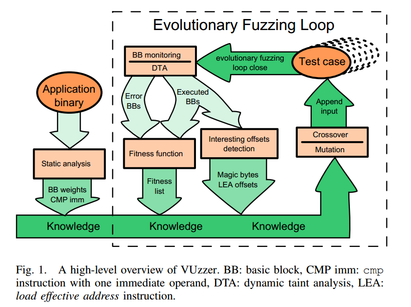

VUzzer:应用敏感的进化Fuzzing工具
================================

摘要：当前fuzzer不能兼顾可扩展性和挖掘深度bug的能力。本文提出了一种应用敏感的进化fuzzing策略，不需要输入格式的先验知识。为了最大化覆盖率和发现深度路径，结合了基于静态和动态分析的控制流和数据流特征，推理应用的基本属性。比黑盒方法更加快速的生成有效输入。在三个不同数据集上实验，本方法比当前fuzzer表现要好。

1.简介
=======

2.背景
=======

3.系统概述
===========

系统结构如上图，包括静态分析（左）和主要的动态fuzzing循环（右）。

工作流程：

1.使用轻量级静态分析获得比较指令的立即数（变异时用）并计算基本块的权重，越深的基本块权重越大（访问概率的倒数）。

2.使用种子初始化种群。执行所有种子输入，进行动态污点分析，获得有效输入的共同特征。特别地，识别魔数和错误处理。

3.执行输入。执行上述生成的输入，记录每个输入执行的基本块。如果输入执行了新的基本块，则污点分析推理输入结构属性。

4.计算适应度，每个输入执行过的所有基本块的权重总和等于该输入的适应度。

5.遗传变异。将种子输入，污点输入和适应度高的输入进行合并、变异，生成ROOT集合。从ROOT中选择两个输入进行交叉变异，生成新的输入。变异包括在输入中删除，替代或者插入字节，变异算子利用数据流特征生成新的值。

6.循环上述操作，直到满足一定条件（如到达一定的数量的crash）。

4.设计和实现
=============

4.1设计细节
------------

1.动态污点分析

动态污点分析是VUzzer区别其他fuzzer的关键技术。VUzzer使用DTA跟踪在cmp和lea指令使用的污点输入。确定参数受输入的哪些字节影响。Lea指令仅跟踪index寄存器。

2.魔数识别：在输入的固定偏移的固定字符串。

3.基本块权重计算：越难到达的路径权重越高，考虑到过程间难以计算，所以在过程内进行计算基本块权重。每个基本块出边赋予相同的概率，一个基本块概率等于其所有前驱概率与连接边概率的乘积之和。循环不考虑回边。最终权重等于概率的倒数。

4.错误处理识别：大部分变异生成的输入都会以错误状态结束，所以要减低这些路径的重要性。本文方法依赖应用的动态行为，以增量方式识别错误处理。

初始化分析：首先，获得所有可用输入的执行基本块并集ValidBB；然后，执行随机输入，如果执行到了ValidBB外的基本块则认为是错误处理。

增量分析：实验观察，90%新生成的输入是以错误处理结束的，如果一个基本块和90%的新输入相关，而且不在ValidBB中，则认为他是错误处理。

错误处理权重计算：错误处理块权重为负值，为平衡错误块在整条路径的作用增加影响系数。

5．适应度计算

输入i的适应度为：

其中，BB(i)是i执行的基本块集合，Freq(b)是输入i执行基本块b的频率，Wb是基本块的权重，li是i的长度，LMAX是提前设置的输入长度。

6. 输入生成

交叉：从上一代中选出两个进行交叉生成下一代。

变异：1.利用Limm生成字符串，从Oother中随机选择污点偏移插入字符串。2.从Llea中随机选择偏移并变异。3.对所有的污点cmp指令，如果不相等，代替污点偏移。4.设置魔数字节。

4.2实现细节
------------

使用Python实现。

静态分析：基于IDA实现字符串解析和基本块权重计算。使用IDAPython实现。

动态分析：基于PIN动态分析框架实现了基本块跟踪和动态符号执行。实现了pintool记录基本块。DTA基于DataTracker(一篇论文，又是基于LibDFT实现的)实现。

Crash分类：基于stack
hash(一篇论文)，使用buffer记录crash前的最后五个函数调用和是个基本块执行。计算buffer的hash作为该crash的指纹，用来区分是否出发的是同一个crash。

5.评估
=======

三个不同的数据集：CGC，“Optimizing seed selection for
fuzzing”文章中使用的混合应用数据集，LAVA文章(Lava: Large-scale automated
vulnerability addition)中使用的二进制集合。

本文仅验证VUzzer相比于AFL识别深度bug的有效性，因为未做效率优化，所以不做效率对比。实验证明，发现可以使用更少的用例发现同样多的crash。

6.相关工作
===========

1.基于进化的测试用例生成

2.白盒Fuzzing：多数使用符号执行，本文不使用符号执行。需要源码支持，本文面向二进制。

3.黑盒、灰盒fuzzing

7.结论
=======

提出了轻量级可扩展的bug发现技术，不使用重量级的符号执行等技术。VUzzer是应用感知的。使用控制流和数据流推断输入的关键部分。控制流使得优先处理感兴趣的路径，为基本块添加权重从而区别输入的适应度。通过DTA监测数据流，推断输入的结构信息，如分支约束等。实验表明，相比于AFL，发现相同的bug，VUzzer使用更少的测试用例。
