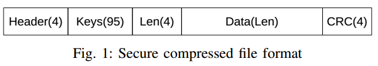
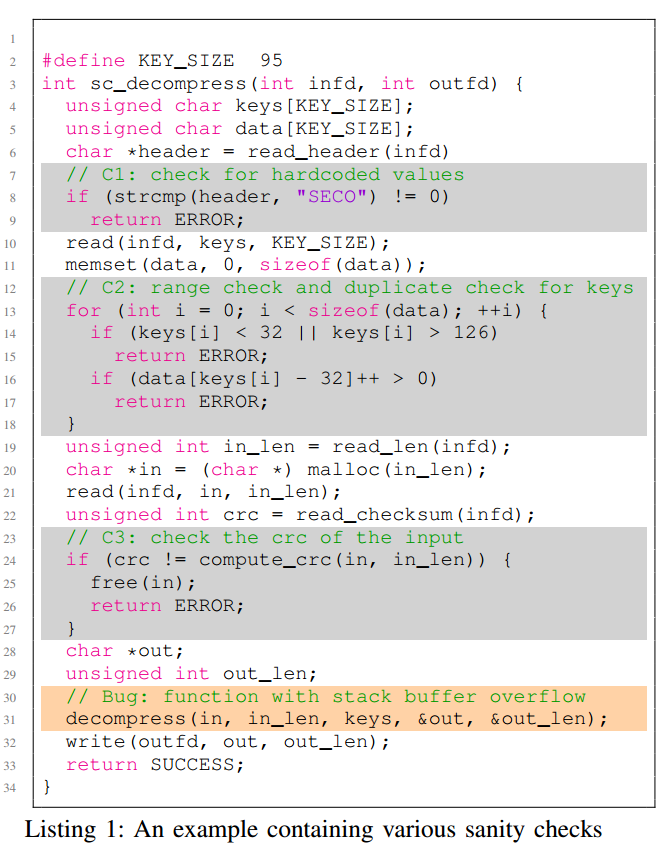
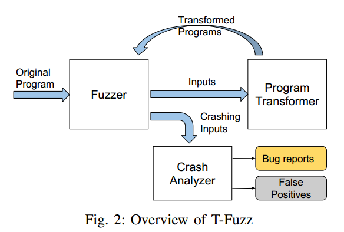
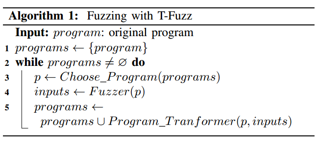
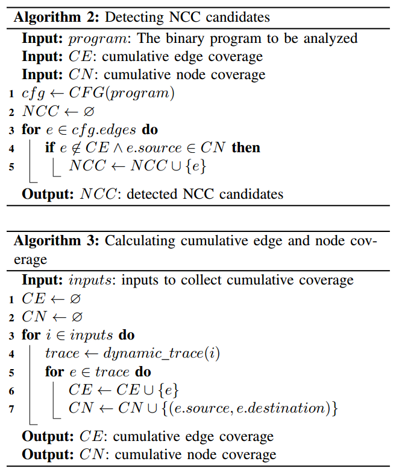
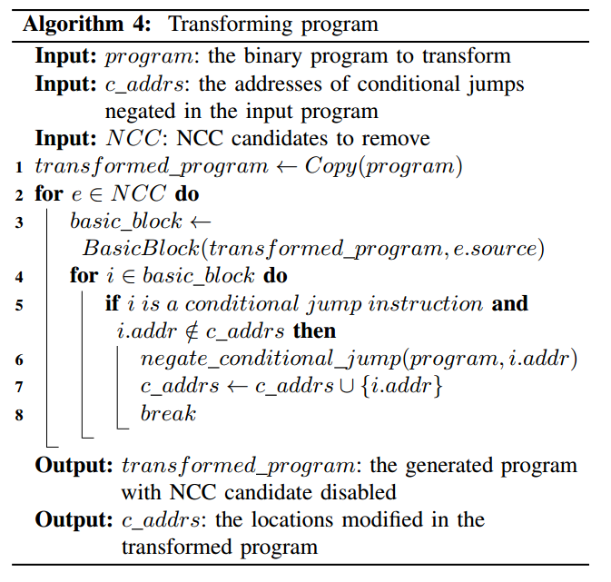
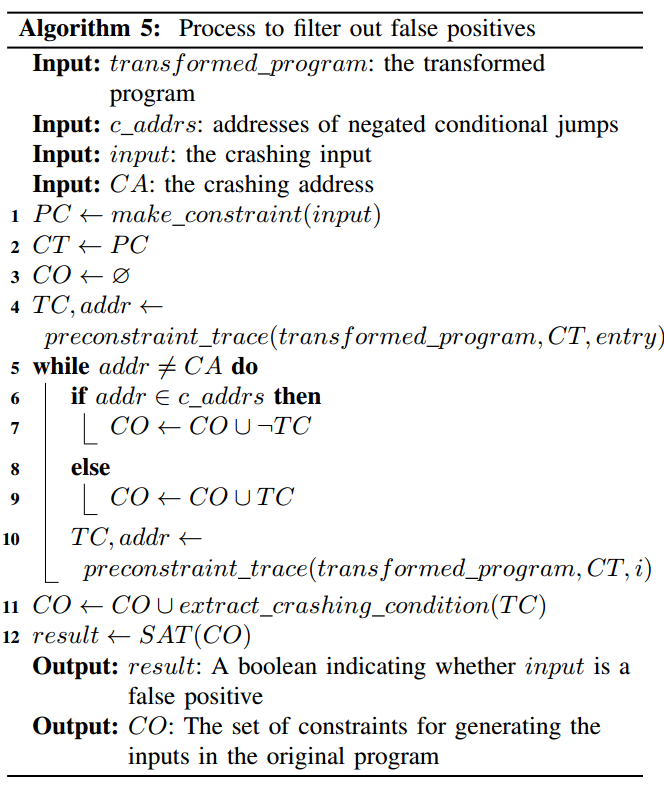
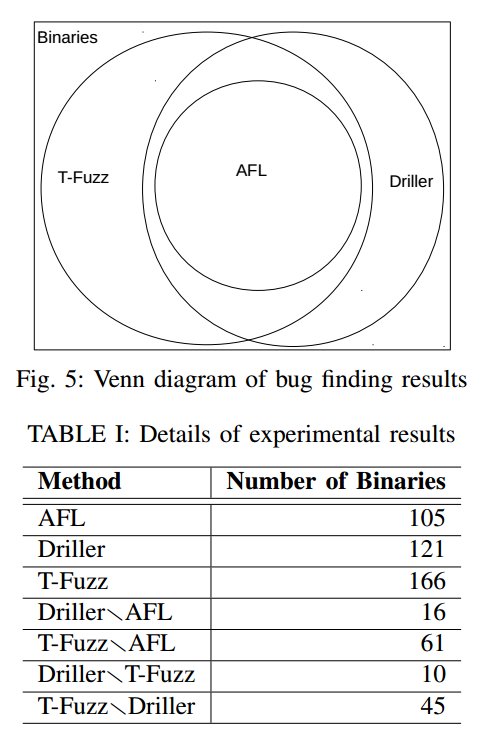
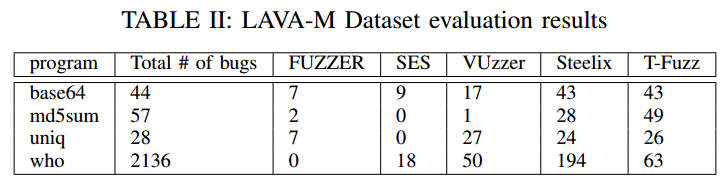
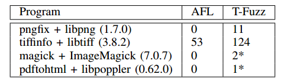

T-Fuzz: 基于程序变换的模糊测试
==============================

当前fuzz随机生成测试用例，不能通过条件检查（sanity
check），覆盖受限，不能发现深层路径中的bug。现有方法通过启发式规则或者复杂输入变异技术（符号执行或污点分析）通过这些检查。

本文通过轻量级动态跟踪技术识别fuzzer不能通过的输入检查，从二进制程序中移除这些检查，在变换后的程序上继续fuzz，探测深层次路径。

程序变换fuzz面临两个挑战：1.溢出检查导致过度近似和误报。2.真实的bug，转换程序上的crash输入可能不能触发潜在bug。作为后端处理步骤，T-Fuzz使用符号执行过滤误报并重现程序中潜在真实bug。

通过程序变换和变异输入，T-Fuzz比当前技术覆盖更多代码，发现更多真实bug。使用CGC测试集，LAVA-M数据集和4个真是程序进行评估。CGC数据集：发现166个二进制的bug，driller发现121个，AFL105个。另外，在之前fuzz过的程序中发现3个新bug。

1. Introduction
===============

Fuzz是一种有效的自动化漏洞挖掘技术。当前策略分为两种：基于生成的（PROTOS，SPIKE，PEACH）和基于变异的（AFL，honggfuzz，zzuf）。基于生成依赖于输入格式，局限性大，当前研究集中于基于变异的。当前fuzz面临的问题是不能通过复杂合理性检查，覆盖受限，不能发现深层次bug。AGL采用覆盖导向的启发式方法辅助变异，取得了巨大成功。另有采用符号执行或污点分析来帮助通过合理性检查。但是，仍存在局限，在CGC测试集中AFL和driller仅能发现不到一半的程序bug。

当前研究都是关注输入的变异和评估，其实也可以对程序进行变化。本文提出一种新fuzz技术，通过移除程序中输入检查，在变换后的程序中进行fuzz，发现bug。移除检查会导致误报，本文使用处理后符号执行分析来删除误报。基于程序变换fuzz技术，我们实现了T-Fuzz原型系统，它采用现有的覆盖导向的fuzzer，当fuzzer不能发现新代码路径，采用轻量级动态跟踪技术发现所有输入不能通过的输入检查。移除这些检查，继续fuzz。

相比于符号分析，T-Fuzz有两个优势：1更好的扩展性，轻量级适用于更大规模程序。2.通过“hard”检查。为了评估和现有方法相比的有效性，在CGC、LAVA-M数据集和四个真实程序依赖库上进行测试（pngfix/libpng,
tiffinfo/libtiff, magick/ImageMagick,
paftohtml/libpoppler）。在CGC数据集中，T-fuzz发现296个程序中的166个存在bug，比driller多45个比afl多61个。在LAVA-M数据集上的测试显示T-Fuzz比steelix和vuzzer可以通过“hard”输入检查，如校验和。实验证明了以少量漏报为代价过滤掉误报。

本文贡献：

1.采用程序变换的方法比重量级程序分析技术高效。

2.提供变异输入和程序的技术：自动检测程序中的合理性检查；移除检查变换程序；重现程序中bug通过顾虑误报。

3.在CGC，LAVA-M和四个实际程序中进行评估。

4.发现3个新的bug，ImageMagick两个，libpoppler1个。

2. Motivation
=============

在如图的实例中，31行存在栈溢出漏洞，若要到达31行必须通过是三个检查：C1魔数检查、C2Keys内容检查，C3
CRC校验。AFL很难通过C1，具有符号执行的driller可以通过C1、C2，但很难通过C3。

观察可得：

1.条件检查分为两种：非关键检查NCC，如魔数检查；关键检查CC，如TCP包解析长度检查。

2.NCC可以直接被移除而不产生误报，移除这些检查可以将存在漏洞的代码暴露出来。

3.上例中检查都不是为了防止漏洞，所以移除之后所发现的漏洞在原程序中可以复现，需要使用可以通过检查的内容填充header、keys和CRC字段。

4.移除关键检查可能会产生误报，因此需要对产生的bug进行过滤。

3. T-Fuzz Intuition
===================

T-Fuzz包含三个模块：

**Fuzzer：**使用覆盖导向的fuzzer，如AFL或honggfuzz。依赖fuzzer跟踪所有输入的路径和实时状态信息，判断是否阻塞。Fuzzer输出所有crash输入，再进行进一步分析。

**程序变换：**当fuzzer阻塞后，T-Fuzzer调用程序变换模块对程序进行变换，跟踪fuzzer生成的输入检测NCC，然后移除程序副本的NCC。

**Crash分析：**使用符号执行技术过滤误报。

T-Fuzz工作流程，首先循环检测目标程序中的NCC，使用一个队列保存需要被测试的程序（包括原程序及其所有变换）。T-fuzz从队列中选择一个程序并加载fuzzer进程进行fuzz，直到不能发现新路径。使用阻塞的输入来检测NCC，通过移除不同的NCC生成多个转换后的程序。转换后的程序被添加到队列中。所有的crash将通过crash分析器进行过滤误报。

4. T-Fuzz 设计
==============

T-Fuzz使用现有版本的AFL作为fuzzer。

**检测NCC：**是T-Fuzz的关键，使用上近似：所有fuzzer不能通过的检查都认为是NCC，因此存在一定误报。使用轻量级、不精确的动态跟踪方法检测它们。

**程序变换：**使用二进制重写来取反NCC。

**过滤误报重现bug：**上述生成的crash中存在误报，采用符号执行过滤误报，不能通过“hard”检查，还需要一定的手工分析。

A.检测NCC
---------

合理性检查在CFG中表现为一个节点两条分支，如果一条分支没有被任何输入执行，则认为是NCC。

在CFG中，CN定义为执行节点的集合，CE定义为执行边的集合，边界边定义为满足以下条件的边e：

1.  e不在CE中；

2.  e的源节点在CN中。

B.对NCC进行修剪
---------------

1.修剪不在期望部分的执行的NCC。

2.剪枝错误检查，导致程序直接结束。

C.程序变换
----------

考虑使用不同方法溢出NCC，比如动态二进制插桩，静态二进制重写，简单的翻转条件跳转指令。前两种都过重，不适用于大规模程序。T-Fuzz采用第三种方法进行程序变换。

D.过滤误报重现bug
-----------------

移除NCC可能在转换程序中导致新bug，所以需要对crash进行验证。T-Fuzz结合了driller的预约束跟踪技术和shellswap的路径融合技术，通过跟踪crash输入在转换程序上的执行来收集路径约束。如路径约束满足，则说明crash可以在原程序中重现。

Crash分析器跟踪转换程序，收集两类约束：在转换程序中的约束CT，在原程序中的约束CO。开始前，将输入改变为预先约束并添加到CT中？在跟踪过程中，如果基本块包含翻转的条件跳转，翻转路径约束添加到CO中，否则添加原约束到CO中。当到达crash触发指令时，将crash触发条件约束添加到CO中。如果CO有解，则说明可以生成输入执行相同路径来触发原程序中的crash，否则认为是误报。

Crash分析器可能会导致漏报，在下节进行详细讨论。

E.运行例子
----------

为了说明误报过滤、重现bug的过程，我们提供了一些具体例子。

5. 实现和评估
=============

基于python实现了原型系统T-Fuzz，采用了开源的AFL，程序变换使用angr
tracer和radare2，crash分析器使用angr实现。

为了评估T-Fuzz发现bug的有效性，我们在三个数据集中进行了测试：CGC、LAVA-M和四个真实程序，并且和当前fuzz工具进行了比较。

A.DARPA CGC数据集
-----------------

包含了248个题目296个二进制程序，包含各类漏洞，提供了漏洞实情和POV。使用三个不同fuzz工具进行比较：启发式fuzz
AFL、符号执行fuzz driller和本文T-Fuzz。使用相同的种子运行24小时。

AFL：每个二进制占用一个CPU，fuzz前使用angr创建字典帮助识别魔数字节。

Driller：每个二进制程序分配一个fuzz CPU和一个符号执行的CPU。

T-Fuzz：使用和AFL一样的CPU核数，多个转换程序按照队列先进先出进行处理。

a)与AFL、driller比较。

发现296个程序中166个漏洞，比afl和driller优势：其中45个包含复杂检查，约束求解很难生成输入。局限性：1.如果NCC翻转导致真实的bug，转换程序将终止而不能执行漏洞代码。2.如果bug隐藏很深，则会导致转换爆炸，太多转换程序需要被执行。

b)与其他工具比较。Steeix对8个cgc赛题进行了测试，仅发现了一个bug。在人工提供种子的前提下10分钟发现bug，T-Fuzz在不需要提供种子的情况下15min发现bug。

Vuzzer对63个CGC赛题进行了6小时的测试，发现了29个bug，T-Fuzz发现47个。

B. LAVA-M 数据集
----------------

LAVA数据集包括了一组自动插入漏洞的程序。LAVA-M是它的一个子集，包括四个工具。比较对象：覆盖导向的fuzz工具FUZZER、基于符号分析工具SES、Vuzzer和Steelix。

T-Fuzz在校验和程序中表现突出。

C.真实程序
----------

在真实程序中评估了T-Fuzz，并和AFL进行比较。

T-Fuzz发现了很多crash，并发现了三个新的bug。

D.减少误报
----------

E.实例研究
----------

6. 相关工作
===========

大量研究来听声fuzz效率，如Rebert和Woo提出种子选择和fuzz调度发现更多bug，但是不能通过复杂检查。

A.基于反馈的方法
----------------

AFL、libFuzzer、AFL-lafintal、Steelix，运行后反馈，不能控制检查，很难通过严格检查。

B.基于符号和具体执行的方法
--------------------------

KLEE、Veritesting、SAGE、DART、SYMFUZZ、CUTE、SmartFuzz和Driller。上述工具中，driller和T-Fuzz最相近，使用符号执行帮助fuzzer生成可以通过检查的测试用例，但是不适用于大规模、严格检查的程序。

C.基于污点分析的方法
--------------------

动态污点分析被用来辅助fuzz，Tainscope关注安全敏感部分的变异。Vuzzer使用数据流和控制流分析，Dowser和BORG使用符号分析来识别依赖关系帮助生成测试用例。但是，这类技术都过重。

D.基于学习的方法
----------------

从大量输入中进行学习，例如Skyfire和Learn&Fuzz从样本中学习不同值的可能分布，GLADE基于综合语法学习来生成输入。基于学习的方法在生成格式较好（如XML）的输入表现很有效，但是很难学习无结构的数据，例如校验和，并且要求大量的学习样本。

E.程序转换
----------

现有程序转换克服检查都需要很多人工辅助。Flayer依赖用户对检查提供地址，TaintScope依赖有能够通过检查的输入。MutaGen依赖程序代码可用性和标识。另外，都需要动态插桩修改目标程序，降低了执行效率。

7. 结论
=======

基于变异的fuzz受限于生成新的输入，很难通过严格的检查。本文提出了程序转换fuzz，扩展了变异fuzz，变异输入的同时也改变程序，实现了T-Fuzz原型系统。在CGC、LAVA-M和四个真实程序中做了评估，证明了T-Fuzz的有效性。

开源代码：<https://github.com/HexHive/T-Fuzz>。
