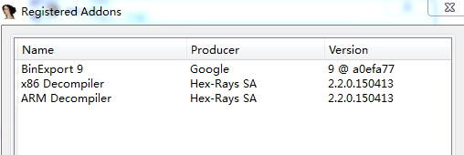
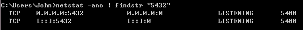
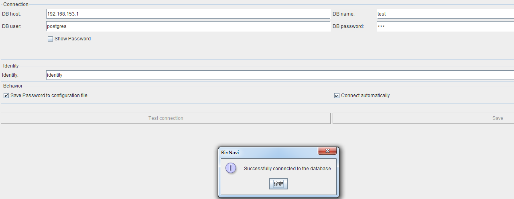
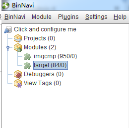
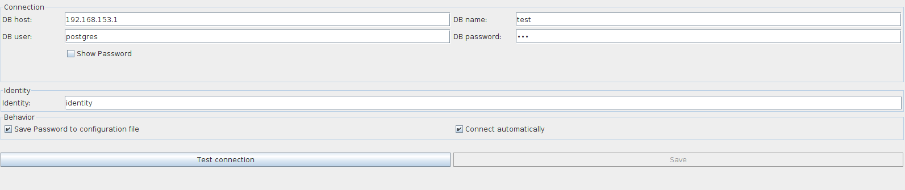
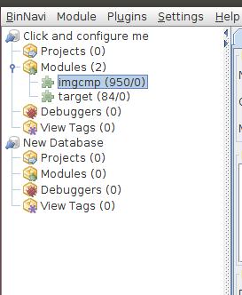

GUEB搭建
========

1.工具介绍
==========

GUEB是法国一篇博士论文中实现的一个面向二进制的UAF静态检测工具，开源地址：<https://github.com/montyly/gueb>。该工具基于BinNavi的分析结果进行UAF检测，架构如图：

本图是来自作者原文

根据理解自己画的图

搭建环境主要涉及几个工具：

IDA：必须能跟BinNavi版本兼容，现在尝试的是IDA
6.8可以，6.4和7.0都不行，主要因为binexport插件不能匹配问题。因此可用IDA仅能在windows上运行。

Binexport：由谷歌提供的一款IDA插件，用于连接IDA和BinNavi，将IDA的反汇编格式导出为BinNavi能够需要的Postgresql数据库格式。因此它需要能够同时兼容IDA和BinNavi。仅能获得8、9、10三个版本，binexport
9只能在IDA 6.8、BinNavi
6.1上运行。因此，它也只能在windows上运行，获取地址：<https://github.com/google/binexport>。

BinNavi：使用的是6.1版本，对应binexport
9，其本身能够在windows和ubuntu上都可以成功运行。获取地址：<https://github.com/google/binnavi>。

Postgresql：BinNavi所使用的数据库，在win和ubuntu上都可以运行。

GUEB：仅能在ubuntu上运行，需要BinNavi API和postgresql数据库支持。

| 名称     | IDA | Binexport | BinNavi    | Postgresql | GUEB  |
|----------|-----|-----------|------------|------------|-------|
| 版本     | 6.8 | 9         | 6.1        | 10.1       | \-    |
| 操作系统 | Win | Win       | Win、linux | Win、linux | Linux |

因为GUEB仅能在ubuntu上运行，因此需要在ubuntu上配置一个可用的BinNavi。配置BinNavi则需要IDA支持，但是ubuntu上没有和当前GUEB兼容的IDA版本（当前仅能获得破解的IDA
6.4和IDA 7
free），直接配置一个ubuntu环境的BinNavi行不通。但是在windows上有可用的IDA
6.8，能够搭建windows环境下的BinNavi。因此想到前后端在不同操作系统上运行，使用共享postgresql数据库的方式将其连接起来。如图所示。

基于共享数据库搭建跨操作系统的GUEB

2 搭建过程
==========

开始搭建环境前，需要有两个操作系统环境，windows 7和ubuntu
14，它们能够通过网络连接，本文中windows的IP地址为192.168.153.1，ubuntu
IP地址为192.168.153.155。

下面，分windows和linux两个部分来讲搭建步骤。

1.2 windows 7
-------------

### 1.2.1 IDA

直接安装IDA Pro 6.8破解版。

### 1.2.2 Binexport

从*https://github.com/google/binexport*下载Binexport 9 for
windows，根据使用说明将文件复制到对应的IDA的安装目录及plugin下。

打开IDA查看安装成功。

### 1.2.3 postgresql

下载postgresql
10，直接安装。完成后配置环境变量，将postgresql安装目录下的bin/假如到系统环境变量中，这样可以在cmd中使用postgresql的命令。

安装完成后配置允许远程连接。

（1）修改postgresql安装目录下data/pg\_hba.conf.

该文件限制允许访问的IP，将“host all all 0.0.0.0/0
md5”添加到最后一行。表示允许所有IPv4地址进行访问。

（2）修改postgresql安装目录下data/postgresql.conf.

该文件中对服务器开放的端口、IP等信息进行配置。修改“listen\_addresses”为“listen\_addresses
= ‘\*’”。（如果默认listen\_addresses
就是‘\*’则不用修改），表示postgresql将在本机所有网卡对应的可用IP上都开放数据库服务，默认端口是‘5432’不用修改。

（3）使用postgresql的pg\_ctl命令重启服务。

cd [datadir]

pg\_ctl restart –D [datadir]

datadir表示postgresql安装目录下的data/文件夹。

（4）通过netstat –ano\|findstr “5432”查看开放端口情况。

表示开放服务成功，‘0.0.0.0:5432’表示开放所有IPv4的5432端口，‘[::]:5432’表示开放了所有IPv6的5432端口。

（5）通过pgAdmin管理postgresql数据库

安装postgresql数据库时自带一个web形式的管理工具。使用该工具可以连接数据库服务，创建数据库，修改数据库等，本文我们创建了一个test数据库。

### 1.2.4 BinNavi

在windows上安装配置BinNavi
6.1。可以通过自己编译，也可以直接使用别人编译好的bin。BinNavi编译、运行需要JAVA环境支撑，需要首先安装JDK8（1.8）。其编译过程在<https://github.com/google/binnavi>有详细介绍。

安装完成后可以通过命令启动BinNavi。

java –jar BinNavi\_HOME/target/binnavi-all.jar

（1） 连接数据库

启动后首先配置数据库连接信息：

如图表示数据库连接成功。

（2）连接IDA

在BinNavi-\>Setting-\>General-\>IDA Pro Installation
Directory中选择IDA的安装目录。如果之前IDA已经安装了Binexport，此处没有问题，没有安装Binexport会提示安装，但是这里安装会出现下载失败（下载文件大小为0），所以建议通过之前复制插件的方法安装Binexport。

### 1.2.5 导入分析目标

此时，我们已经完成了windows上环境搭建，一个完整的BinNavi环境，且是通过远程访问的方式连接到数据库。我们可以将需要分析的目标程序导入到BinNavi中。

（1）使用IDA打开分析目标，生成idb或i64文件。

（2）在BinNavi-\>Click and configure me-\>Modules处右键，Import IDB
file。可以将其成功导入到输入库中。如图，本例导入了两个目标程序。

1.3 ubuntu 14
-------------

转到ubuntu上进行配置，ubuntu上也需要配置一个BinNavi，但它不需要导入IDB的功能，仅需要能够通过共享数据库读取之前导入到数据库的目标程序。然后GUEB根据BinNavi提供的API和postgresql数据库中的目标程序就可以完成分析。

### 1.3.1 BinNavi

Ubuntu上也需要配置JAVA
8环境，同样可以使用编译的方法获得BinNavi，也可以直接使用已经编译好的jar。

（1）启动BinNavi。

java –jar BinNavi\_HOME/target/binnavi-all.jar

（2）连接数据库

同样需要配置数据库连接信息。

连接成功后可以看到数据库中已经导入的目标程序。

### 1.3.2 GUEB

上述完成后就可以下载安装GUEB了，<https://github.com/montyly/gueb>。网页中有较详细的步骤。但是少了一步配置数据库和BinNavi安装路径。

编辑GUEB\_HOME/export/export\_protobuf.py，修改文件开头部分的配置信息。然后就可以根据网页说明进行运行GUEB了。

因为是三个客户端（win BinNavi，linux BinNavi和Linux
GUEB）共享了数据库，因此尽量避免同时对数据库修改操作，会导致一些bug。
